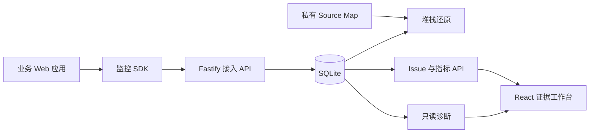

# TracePilot

前端可观测与证据化 AI 辅助诊断平台。它把浏览器错误、请求、用户操作、Web Vitals、Release
和 Source Map 串成一条可以先核验、再诊断的证据链。

当前仓库是一个可本地完整运行的 MVP：不依赖 Docker，不需要外部模型密钥，也不会执行命令
或修改业务代码。

## 已实现

- 插件化浏览器 SDK：runtime error、unhandled rejection、资源错误、Fetch/XHR、点击/路由
  Breadcrumb、LCP、INP、CLS、FCP、TTFB。
- 安全传输：采样、短窗口错误去重、批量/定时上报、有限重试、`sendBeacon`、`beforeSend`、
  SDK 请求递归保护、完整 teardown。
- Fastify 接入服务：共享 Zod Schema、DSN 校验、事件幂等、二次脱敏、SQLite 事务、Drizzle
  表定义、动态 ID 归一化与 SHA-256 指纹聚合。
- 调查工作台：项目、筛选/分页 Issue、趋势、影响用户、浏览器/路由/Release 分布、源码堆栈、
  证据链、网络、事件、性能、Release 和诊断报告。
- Source Map：私有上传、Release 隔离、文件大小/格式限制、压缩堆栈还原、缺失地图降级。
- 诊断：受控上下文、再次脱敏、Zod 结构化输出、证据/置信度/缺失信息、Token/耗时/版本记录、
  输入哈希缓存。
- 演示与质量：307 条虚构种子事件、Incident Playground、单元/接口/E2E、基准和诊断冒烟评测。

## 架构



核心原则：模型不可用时监控仍然可用；每条诊断原因必须能回指存储证据；Source Map 和密钥永不
发往浏览器。

## 快速开始

要求 Node.js 22+、pnpm 10+。

```bash
pnpm install
pnpm seed
pnpm dev
```

启动后：

- 调查工作台：[http://localhost:4173](http://localhost:4173)
- 事故演练场：[http://localhost:4174](http://localhost:4174)
- 服务健康检查：[http://localhost:4318/health](http://localhost:4318/health)

首次使用建议阅读[平台使用手册](docs/user-guide.md)，其中包含逐页面操作、SDK 接入、日常排障、
Source Map、AI 诊断和常见问题。

`pnpm seed` 会重建 `demo-project` 的虚构数据；它不包含真实公司或用户信息。

### 可选外部模型

没有 `MODEL_API_KEY` 时，项目使用明确标记的 `local-evidence-engine`，因此离线演示和测试仍可
完成。若要调用 OpenAI：

```bash
cp .env.example apps/server/.env
# 在 apps/server/.env 中设置 MODEL_API_KEY；可按需覆盖 MODEL_NAME 和 MODEL_API_URL
pnpm dev
```

通过 pnpm filter 启动包脚本时，Server 的工作目录是 apps/server，因此服务端环境文件应放在该
目录。

外部适配层使用 Responses API 的 Zod 结构化输出；返回结果仍会再经过共享 Schema 校验后才写入
数据库。API Key 仅由 Server 读取。

## SDK 接入

```ts
import { createMonitor } from '@trace-pilot/monitor-sdk';

const monitor = createMonitor({
  dsn: 'http://localhost:4318/api/v1/envelopes',
  dsnKey: 'demo-dsn-key',
  projectId: 'demo-project',
  release: '2.4.1',
  environment: 'production',
  user: { id: 'fictional-user-42' },
  beforeSend(event) {
    // 可在业务侧删除额外字段；Server 仍会独立脱敏。
    return event;
  },
});

monitor.start();
monitor.captureException(new Error('Checkout failed'));
await monitor.flush();
monitor.destroy();
```

Playground 已提供 runtime、Promise、资源、Fetch、XHR、SPA 路由和手动消息场景。

## Source Map 工作流

1. 创建与构建一致的 Release。
2. 在 Dashboard 的 Releases 页面展开 Release。
3. 填写线上 minified filename 并上传 `.map`。
4. 同一 Release 的历史事件会立即重新解析；新事件入库时也会尝试解析。

服务端仅保存随机命名的私有文件，不提供下载接口。默认单文件上限为 10 MB。

## 常用命令

```bash
pnpm dev                  # 并行启动全部应用/包的开发模式
pnpm seed                 # 重建虚构演示数据
pnpm verify               # lint + typecheck + unit/integration + build
pnpm smoke:production     # 加载 ESM/CJS 包并启动构建后的服务端
pnpm test:e2e             # 真实浏览器闭环测试
pnpm benchmark            # 本地 SQLite API 基准
pnpm measure:sdk          # SDK minified/gzip 体积
pnpm evaluate:diagnosis   # 本地诊断契约与缓存冒烟评测
```

## 本机实测基线

这些数字来自 2026-08-12 的本地临时数据库/构建，不代表生产容量：

| 指标                                   |              结果 |
| -------------------------------------- | ----------------: |
| SDK minified ESM                       |      13,556 bytes |
| SDK gzip ESM                           |       4,419 bytes |
| 10 事件接入批次 P50 / P95              | 1.88 ms / 2.28 ms |
| Issue 列表查询 P50 / P95               | 0.13 ms / 0.16 ms |
| 本地诊断结构化成功率（4 个固定 Issue） |              100% |
| 未变化上下文缓存命中率                 |              100% |
| Playwright 完整闭环                    |      7 / 7 passed |

复现方式和限制见 [性能报告](docs/reports/performance.md) 与
[诊断评测报告](docs/reports/diagnosis-evaluation.md)。简历或演示材料不应把这些本机数字包装成
生产 SLA。

## API 摘要

| 方法    | 路径                                      | 作用                 |
| ------- | ----------------------------------------- | -------------------- |
| `POST`  | `/api/v1/envelopes`                       | 批量事件接入         |
| `GET`   | `/api/v1/projects/:projectId/issues`      | 分页与筛选 Issue     |
| `GET`   | `/api/v1/issues/:issueId`                 | Issue 和最新现场     |
| `GET`   | `/api/v1/issues/:issueId/events`          | 最近事件样本         |
| `PATCH` | `/api/v1/issues/:issueId/status`          | 更新处理状态         |
| `POST`  | `/api/v1/projects/:projectId/releases`    | 创建 Release         |
| `POST`  | `/api/v1/releases/:releaseId/source-maps` | 私有 Source Map 上传 |
| `POST`  | `/api/v1/issues/:issueId/diagnoses`       | 生成或复用诊断       |
| `GET`   | `/api/v1/projects/:projectId/performance` | Web Vital 分位数     |

## 安全边界

- 默认清理 URL query、Authorization、Cookie、密码、Token、Secret 和 API Key 形态字段。
- 请求体默认不采集；Source Map 目录、SQLite 文件和 `.env` 均被 Git 忽略。
- 接入体积 1 MB；Source Map 10 MB；事件批次最多 100 条；Breadcrumb 最多 100 条。
- 诊断没有 Shell、文件、Git、浏览器或业务写入工具；Provider 失败只影响该次诊断。
- 当前是本地单用户 MVP，尚未实现身份认证、租户隔离、生产限流和保留策略。

## 目录

```text
apps/dashboard       React 调查工作台
apps/server          Fastify、SQLite、Source Map 与诊断
apps/playground      可控制造浏览器信号
packages/monitor-sdk 插件化浏览器 SDK
packages/shared      Zod Schema、类型、隐私工具
docs/stages          每阶段实现与验证记录
tests/e2e            浏览器闭环测试
```

完整操作见[平台使用手册](docs/user-guide.md)，详细设计见
[architecture.md](docs/architecture.md)，3–5 分钟演示顺序见
[demo-script.md](docs/demo-script.md)。

## 仍然不做

Session Replay、自动改代码、Shell/测试执行、Agent 工具调用、Kafka/ClickHouse、Kubernetes 和
企业多租户不属于本 MVP。只有监控闭环稳定并有真实压测后，才适合引入 PostgreSQL、异步队列、
SSE 或 Agent 化能力。

## 许可证

MIT
