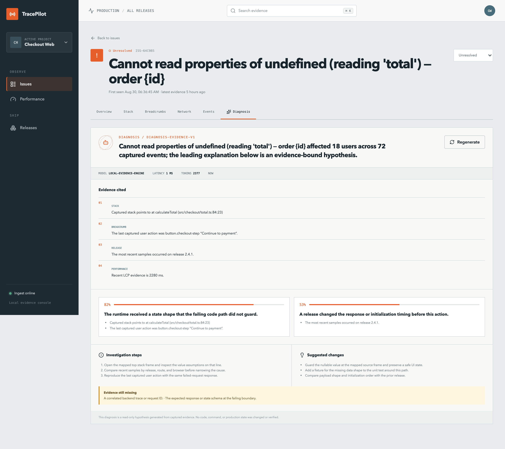
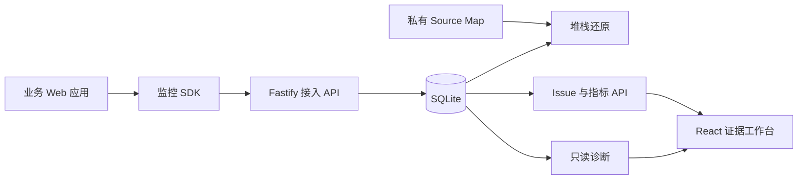

# TracePilot

前端可观测与证据化 AI 辅助诊断平台。它把浏览器错误、请求、用户操作、Web Vitals、Release
和 Source Map 串成一条**可以先核验、再诊断**的证据链。

AI 只是最后一环，而且被刻意限制：它只能引用已存储的证据，不能执行任何写操作，模型不可用时
降级到确定性的本地引擎。因为排障场景里，模型编造根因的代价很高。


> 一次事故被还原成有时序的证据：路由跳转 → 用户点击 → 网络请求 → 运行时报错。
> 所有画面由 `pnpm screenshots` 从真实运行的应用生成，不是手工截屏。

## 5 分钟本地跑通

不需要 Docker，不需要模型密钥。要求 Node.js 22+、pnpm 10+。

```bash
pnpm install && pnpm seed && pnpm dev
```

- 调查工作台 [localhost:4173](http://localhost:4173) · 事故演练场 [localhost:4174](http://localhost:4174)
- 在演练场点几个按钮制造真实浏览器信号，回到工作台看它们如何被聚合成 Issue
- 逐页面操作见[平台使用手册](docs/user-guide.md)，3–5 分钟演示顺序见 [demo-script.md](docs/demo-script.md)

没有 `MODEL_API_KEY` 时诊断走明确标记的 `local-evidence-engine`，因此离线也能完整体验。

## 四个技术难点

用「问题 — 方案 — 结果 — 限制」描述。每个结果都能由命令复现，限制都写明了。

### 1. 体积预算测错了对象

**问题**　SDK 发布产物 gzip 4.4 KB，但这个数字只称量了产物文件本身。tsup 默认把 workspace
依赖 external 化，产物里只留下 `import ... from "@trace-pilot/shared"`——**称不到这条依赖链**。

**方案**　补一个「真实接入方」探针：以 workspace 内真实引用 SDK 的应用为解析目录，用 esbuild
打包一个只调用 `createMonitor` 的入口，测量业务应用实际多付出的字节。同时断言产物中不得出现
zod 运行时标识符。

**结果**　探针发现真实接入成本是 **18,763 字节 gzip，含 164 处 zod 标识符**——barrel 文件把
整个 zod 拖进了浏览器包。根因是两个包都没声明 `"sideEffects": false`，打包器不敢摇掉那条导入。
补上之后降到 **4,324 字节，zod 标识符归零**。两个口径现在都有预算，超出即 CI 失败。

**限制**　探针基于 esbuild 默认配置，webpack / rspack 的摇树结论可能不同。

### 2. 接入路径的写入放大

**问题**　Issue 的 `event_count` 和 `user_count` 原本对每条入库事件都用 `COUNT(*)` 从 events
表重新派生，图的是幂等。但单次写入因此退化为 O(Issue 内事件数)。

**方案**　幂等其实已经由前置的 `eventId` 去重保证了——重复批次在插入前就跳过。所以计数可以
增量累加；`user_count` 只在该用户首次出现于此 Issue 时 +1，判定走 `(issue_id, user_id)` 索引。

**结果**　同一基准把事件量放大到 1 万条并按接入进度分段，延迟从线性增长变成恒定：

| Issue 内已有事件 | 改动前 P50 | 改动后 P50 |
| ---------------- | ---------: | ---------: |
| 1,000            |    1.79 ms |    1.14 ms |
| 5,000            |    6.57 ms |    0.96 ms |
| 10,000           |   12.88 ms |    0.98 ms |

**限制**　本机 SQLite 是单写者模型，天然避开了并发计数的竞态；换 PostgreSQL 需要原子更新或
行锁。这个数字是进程内测量，不含网络与 TLS，不能当作生产容量。

**踩过的坑**　「该用户是否已出现」的判定必须在事件落库**之前**执行，否则会查到刚写入的那一行，
`user_count` 恒为 0。第一版就写反了，是既有测试断言抓出来的；现在有一条回归测试专门锁定这个顺序。

### 3. 递归防护的闸门误伤了生命周期收尾

**问题**　SDK 核心用一个 `protecting` 标志包裹插件生命周期，本意是「监控代码不能破坏宿主应用，
也不能把自身异常再次采集形成递归风暴」。但 `PerformancePlugin` 的最终 LCP / CLS / INP 正是在
`teardown()` 里提交的——于是 `destroy()` 会**静默丢弃全部最终指标**。SPA 组件卸载、热更新、
React StrictMode 双次挂载都会走到这条路径。

单元测试没能发现，因为它注入的是 mock core，完全绕开了核心的闸门。

**方案**　这个标志挂错了对象。递归风险的本质是「采集过程再次触发采集」，与插件生命周期无关。
拆成三个：`protecting` 只管 `protect()` 不嵌套；`suppressCapture` 在 setup 期间屏蔽采集
（包装全局 API 的副作用不是业务事件），teardown 显式放行；`capturing` 才是采集路径自身的重入闸门。

**结果**　`destroy()` 现在会正常提交最终指标。第三个标志还顺带补上了一个原先存在的漏洞：
`beforeSend` 如果在回调里再次调用 `captureException`，旧实现会无限递归下去，而 `protecting`
完全管不到那条路径。同时新增一条接**真实** `MonitorCore` 的集成测试，堵住那个测试盲区。

**限制**　teardown 期间放行采集，意味着这里依赖 Transport 在构造时就保存了原始 `fetch`
引用、且对自身上报打了标记——递归防护由这两层承担，而不再由生命周期闸门兜底。

**后续验证**　`pnpm measure:sdk-runtime` 在真实浏览器里跑 20 轮 `start()` / `destroy()`，
断言残留监听器为 0、且 `fetch` / `XHR.open` / `XHR.send` / `history.pushState` /
`history.replaceState` 全部还原为插桩前的引用。探针在页面加载前包装 `EventTarget`
逐个记录 (target, type, handler, capture) 组合——这是判断 teardown 是否真的对称的唯一
可靠方式，因为 `removeEventListener` 必须拿到与注册时同一个函数引用和同样的 capture 标志。
三条负向测试验证过这些断言确实会失败，不是摆设。

### 4. Source Map 的行列坐标语义

**问题**　浏览器堆栈的列号是 **1 基**，`source-map` 库的 Consumer 是 **0 基**。转换写错一次，
映射结果会整体偏移一列，而且在 `:1:0` 这类边界上看不出来。

**方案**　读入时 `column - 1`，写出时 `column + 1`，两次转换都集中在一处。Release 是隔离边界：
同一个文件名在不同版本对应不同的 map，查找必须带上 release。`.map` 只存在服务端私有目录
（权限 0600、随机文件名），不提供任何下载端点。

**结果**　压缩栈 `checkout.a81e93bd.js:1:420` 被还原为 `src/checkout/total.ts:84:23`，
并且还原结果会进一步进入诊断的证据上下文：


**限制**　测试刻意避开 `:1:0`，否则 0 基/1 基的偏移会被「恰好都是 0」掩盖。找不到 map 时保留
压缩栈作为降级证据，而不是让调查中断。

<details>
<summary>其他值得一看的取舍（点开）</summary>

- **Monkey patch 的可逆性**　`NetworkPlugin` 在插桩前保存原始 `fetch`/`XMLHttpRequest` 引用，
  `teardown` 时还原；监听器保存同一函数引用才能正确 `removeEventListener`。
  **已知缺口**：若第三方在本 SDK 之后也 patch 了 `fetch`，`destroy()` 无条件赋回原始引用会
  覆盖对方的包装。
- **错误指纹的动态 ID 归一化**　UUID、长数字 ID、chunk hash、query string、空白字符在参与
  SHA-256 之前统一替换成占位符，否则同一根因的每次发生都会被拆成新 Issue。归一化过度会合并
  不同错误，不足会让一个错误炸成上千 Issue——这条线的位置见 `apps/server/src/lib/fingerprint.ts`。
- **传输层的退出路径**　`pagehide` 触发的冲刷必须优先于「有请求在途」的判断，否则队列会随页面
  一起消失。队列有上限（默认 1000），满时丢弃**最新**事件而非最旧的——事故的最早证据诊断价值最高。
- **命令式图表库与 React 的共存**　ECharts 实例的生命周期和数据更新必须拆成两个 effect。
  写在一起、依赖 `[option]` 时，上游 `useMemo` 依赖 React Query 的 data，每次 refetch
  都是新引用——于是每轮轮询所有图表整体重建（300 次更新新建 1,500 个 canvas）。
  拆开后同一指标降到 0 个，同步开销约减半。
- **AI 诊断的两层校验**　Provider 的结构化输出解析一次，落库前再用共享 Zod Schema 校验一次。
  两层刻意冗余，形成信任边界；模型返回无效 JSON 时隔离为 502，不影响已存储的 Issue 证据。

</details>

## 本机实测基线

这些数字来自 2026-08-31 的本地临时数据库/构建，**不代表生产容量**：

| 指标                                     |                结果 | 复现命令                   |
| ---------------------------------------- | ------------------: | -------------------------- |
| SDK 发布产物 minified / gzip             | 14,566 / 4,639 字节 | `pnpm measure:sdk`         |
| **业务应用实际接入成本** minified / gzip | 14,312 / 4,522 字节 | `pnpm measure:sdk`         |
| 10 事件接入批次 P50 / P95                |   0.97 ms / 1.49 ms | `pnpm benchmark`           |
| 单 Issue 累积 1 万事件时接入 P50         |             0.98 ms | `pnpm benchmark`           |
| Issue 列表查询 P50 / P95                 |   0.75 ms / 1.08 ms | `pnpm benchmark`           |
| 本地诊断结构化成功率（16 个种子 Issue）  |                100% | `pnpm evaluate:diagnosis`  |
| 未变化上下文缓存命中率                   |                100% | `pnpm evaluate:diagnosis`  |
| `createMonitor()` + `start()` P50 / P95  |          10 / 50 µs | `pnpm measure:sdk-runtime` |
| 单次 `captureException` P50 / P95        |            4 / 7 µs | `pnpm measure:sdk-runtime` |
| 20 轮 start/destroy 后残留监听器         |                0 个 | `pnpm measure:sdk-runtime` |
| 图表轮询更新 P50（重建 → 复用）          |      2.51 → 1.35 ms | `pnpm measure:chart`       |
| 300 次更新新建 canvas（重建 → 复用）     |        1,500 → 0 个 | `pnpm measure:chart`       |
| 单元 / 集成测试                          |           36 项通过 | `pnpm verify`              |
| 浏览器闭环测试                           |        9 / 9 passed | `pnpm test:e2e`            |

体积同时报告两个口径：发布产物本身，以及业务应用把 SDK 打进自己包后实际付出的字节。
两者会背离——workspace 依赖被 external 化后，只测产物会漏掉整条依赖链。
`pnpm measure:sdk` 对两个口径都设了预算，超出即 CI 失败。

基准把 1 万个事件全部聚合到同一个 Issue，是接入路径的最坏情况；报告中的
`ingestWriteAmplification` 分段验证单条写入开销不随 Issue 内事件数增长。

运行时开销在真实浏览器里测量，并附带两项**与机器快慢无关的硬断言**：20 轮 start/destroy
后监听器残留必须为 0，且 `fetch`、`XHR.open/send`、`history.pushState/replaceState`
必须全部还原为插桩前的引用。错误风暴分「重复」与「独特」两个场景——前者验证短窗口去重
（500 个错误挡下 490），后者验证队列上限（200 个独特错误，50 条驻留、150 条丢弃）。

复现方式、口径差异和限制见[性能报告](docs/reports/performance.md)与
[诊断评测报告](docs/reports/diagnosis-evaluation.md)。**引用这些数字时请连同限制条件一起引用，
不要把本机测量包装成生产 SLA。**

## 更多画面

|                                                    |                                                   |
| -------------------------------------------------- | ------------------------------------------------- |
|       |     |
| 聚合后的 Issue、筛选与趋势                         | 证据约束的只读诊断：置信度、缺失信息、免责声明    |
|  |  |
| 分位数与按 Release / 路由 / 浏览器的对比           | 可控地制造真实浏览器信号                          |

`pnpm screenshots` 可重新生成全部截图。

## 架构



核心原则：模型不可用时监控仍然可用；每条诊断原因必须能回指存储证据；Source Map 和密钥永不
发往浏览器。

技术栈：`React 19 · TypeScript · Fastify 5 · SQLite/Drizzle · pnpm Monorepo · Vite 7 · Playwright`

详细设计见 [architecture.md](docs/architecture.md)，关键决策见
[ADR 0001](docs/decisions/0001-typescript-monorepo.md) 与
[ADR 0002](docs/decisions/0002-read-only-evidence-diagnosis.md)。

## 已实现

- **插件化浏览器 SDK**：runtime error、unhandled rejection、资源错误、Fetch/XHR、点击/路由
  Breadcrumb、LCP、INP、CLS、FCP、TTFB。
- **安全传输**：采样、短窗口错误去重、批量/定时上报、有限重试、队列上限、`sendBeacon` 退出
  排空、`beforeSend`、SDK 请求递归保护、完整 teardown。
- **Fastify 接入服务**：共享 Zod Schema、DSN 校验、事件幂等、二次脱敏、SQLite 事务、Drizzle
  表定义、动态 ID 归一化与 SHA-256 指纹聚合。
- **调查工作台**：项目、筛选/分页 Issue、趋势、影响用户、浏览器/路由/Release 分布、源码堆栈、
  证据链、网络、事件、性能、Release 和诊断报告。
- **Source Map**：私有上传、Release 隔离、文件大小/格式限制、压缩堆栈还原、缺失地图降级。
- **诊断**：受控上下文、再次脱敏、Zod 结构化输出、证据/置信度/缺失信息、Token/耗时/版本记录、
  输入哈希缓存。
- **演示与质量**：307 条虚构种子事件、16 个错误根因分组、Incident Playground、单元/接口/E2E、
  基准、体积预算和诊断冒烟评测。

## SDK 接入

```ts
import { createMonitor } from '@trace-pilot/monitor-sdk';

const monitor = createMonitor({
  dsn: 'http://localhost:4318/api/v1/envelopes',
  dsnKey: 'demo-dsn-key',
  projectId: 'demo-project',
  release: '2.4.1',
  environment: 'production',
  user: { id: 'fictional-user-42' },
  beforeSend(event) {
    // 可在业务侧删除额外字段；Server 仍会独立脱敏。
    return event;
  },
});

monitor.start();
monitor.captureException(new Error('Checkout failed'));
await monitor.flush();
monitor.destroy();
```

Playground 已提供 runtime、Promise、资源、Fetch、XHR、SPA 路由和手动消息场景。

### 可选外部模型

```bash
cp .env.example apps/server/.env
# 在 apps/server/.env 中设置 MODEL_API_KEY；可按需覆盖 MODEL_NAME 和 MODEL_API_URL
pnpm dev
```

通过 pnpm filter 启动包脚本时，Server 的工作目录是 apps/server，因此服务端环境文件应放在该目录。

**适配层按端点能力降级，而不是按厂商名字硬编码**：先试 Responses API + Zod 结构化输出，
若端点以 404 或「不支持该 response_format」类错误拒绝，则降级到 chat/completions +
`json_object` + 提示词内嵌 schema（schema 由同一份 Zod 定义生成，避免两处漂移）。
鉴权失败、限流、超时不触发降级——那只会把一次失败变成两次收费。

两条路径最终都要过同一个共享 Zod Schema 才会落库。API Key 仅由 Server 读取。

已实测可接入（2026-08-31）：

| 端点     | `MODEL_API_URL`               | 走通的通道                          |
| -------- | ----------------------------- | ----------------------------------- |
| OpenAI   | `https://api.openai.com/v1`   | Responses API                       |
| DeepSeek | `https://api.deepseek.com/v1` | Responses API（降级路径亦实测通过） |

DeepSeek 的能力分布与直觉相反：它**支持** Responses API 的严格 json_schema，却拒绝
`chat/completions` 的 `json_schema`（400 `This response_format type is unavailable now`）。
这正是「按能力探测而不是按厂商假设」的理由。

## Source Map 工作流

1. 创建与构建一致的 Release。
2. 在 Dashboard 的 Releases 页面展开 Release。
3. 填写线上 minified filename 并上传 `.map`。
4. 同一 Release 的历史事件会立即重新解析；新事件入库时也会尝试解析。

服务端仅保存随机命名的私有文件，不提供下载接口。默认单文件上限为 10 MB。

## 常用命令

```bash
pnpm dev                  # 并行启动全部应用/包的开发模式
pnpm seed                 # 重建虚构演示数据
pnpm verify               # lint + typecheck + 单元/集成 + build + 体积预算 + 冒烟
pnpm test:e2e             # 真实浏览器闭环测试
pnpm screenshots          # 从运行中的应用重新生成 README 截图
pnpm benchmark            # 本地 SQLite API 基准与写入放大分段
pnpm measure:sdk          # SDK 产物体积与真实接入成本，含预算断言
pnpm measure:sdk-runtime  # 真实浏览器里的运行时开销与泄漏回归
pnpm measure:chart        # 图表更新策略的对照测量
pnpm evaluate:diagnosis   # 本地诊断契约与缓存冒烟评测
pnpm smoke:production     # 加载 ESM/CJS 包并启动构建后的服务端
```

## API 摘要

| 方法    | 路径                                      | 作用                 |
| ------- | ----------------------------------------- | -------------------- |
| `POST`  | `/api/v1/envelopes`                       | 批量事件接入         |
| `GET`   | `/api/v1/projects/:projectId/issues`      | 分页与筛选 Issue     |
| `GET`   | `/api/v1/issues/:issueId`                 | Issue 和最新现场     |
| `GET`   | `/api/v1/issues/:issueId/events`          | 最近事件样本         |
| `PATCH` | `/api/v1/issues/:issueId/status`          | 更新处理状态         |
| `POST`  | `/api/v1/projects/:projectId/releases`    | 创建 Release         |
| `POST`  | `/api/v1/releases/:releaseId/source-maps` | 私有 Source Map 上传 |
| `POST`  | `/api/v1/issues/:issueId/diagnoses`       | 生成或复用诊断       |
| `GET`   | `/api/v1/projects/:projectId/performance` | Web Vital 分位数     |

## 安全边界与已知限制

- 默认清理 URL query、Authorization、Cookie、密码、Token、Secret 和 API Key 形态字段。
- 请求体默认不采集；Source Map 目录、SQLite 文件和 `.env` 均被 Git 忽略。
- 接入体积 1 MB；Source Map 10 MB；事件批次最多 100 条；Breadcrumb 最多 100 条。
- 诊断没有 Shell、文件、Git、浏览器或业务写入工具；Provider 失败只影响该次诊断。
- **当前是本地单用户 MVP**：没有身份认证、租户隔离、生产限流和数据保留策略。管理类接口
  （建项目、改 Issue 状态、上传 map、触发诊断）在本地是开放的——若要部署到公网，这些是
  上线前必须先处理的项。
- Issue 列表为每个 Issue 单独查询趋势桶（N+1），性能查询会把窗口内样本全部读入内存。
  当前数据规模下不构成问题，但都是明确的扩展限制。

## 目录

```text
apps/dashboard       React 调查工作台
apps/server          Fastify、SQLite、Source Map 与诊断
apps/playground      可控制造浏览器信号
packages/monitor-sdk 插件化浏览器 SDK
packages/shared      Zod Schema、类型、隐私工具
scripts              体积测量、生产冒烟、README 截图
docs/reports         性能与诊断评测的权威基线
docs/stages          每阶段实现与验证记录
tests/e2e            浏览器闭环测试
```

## 代码阅读

如果你不熟悉项目中的 TypeScript、Zod、浏览器 SDK、Fastify、SQLite/Drizzle、React Query 或
Playwright，可以按[代码阅读指南](docs/code-reading-guide.md)给出的数据流和文件顺序学习。
核心源码也已补充中文注释，重点解释生命周期、缓存、事务、隐私和降级策略。

真实浏览器检查结果见[浏览器质量审查](docs/reports/browser-audit.md)，后续补强项见
[TODO.md](TODO.md)。

## 仍然不做

Session Replay、自动改代码、Shell/测试执行、Agent 工具调用、Kafka/ClickHouse、Kubernetes 和
企业多租户不属于本 MVP。只有监控闭环稳定并有真实压测后，才适合引入 PostgreSQL、异步队列、
SSE 或 Agent 化能力。

## 许可证

MIT
