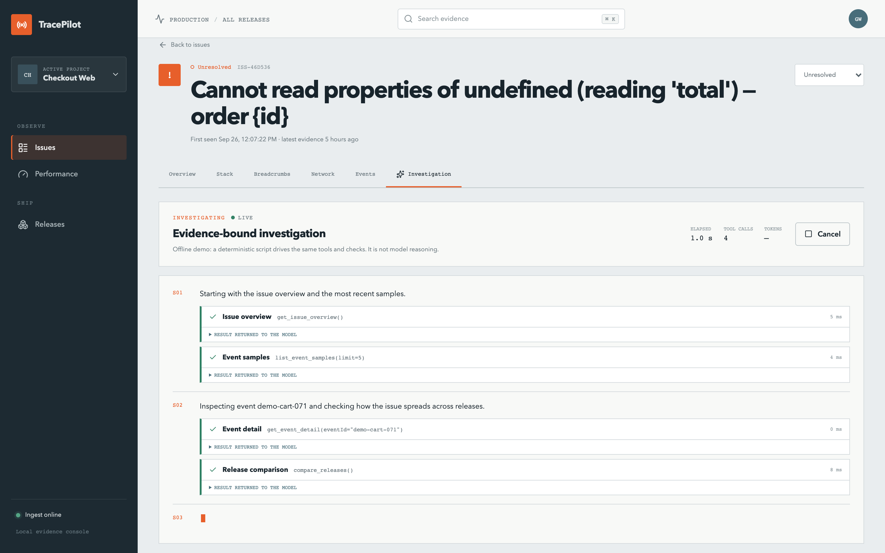
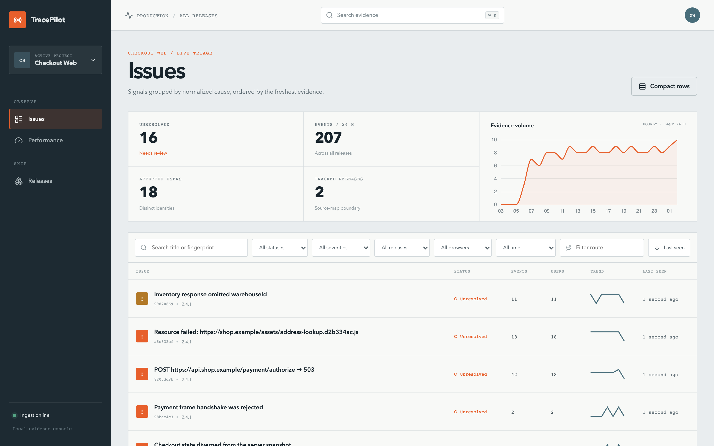
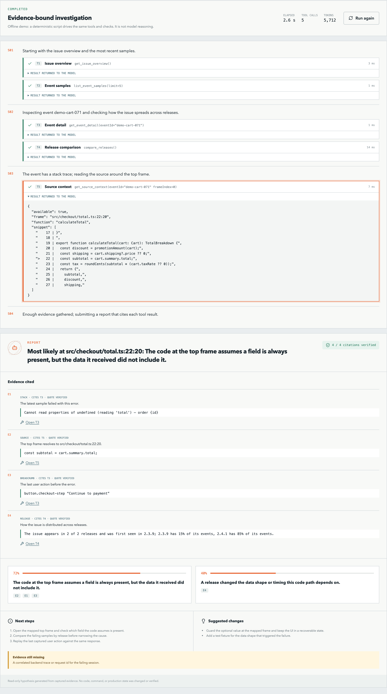
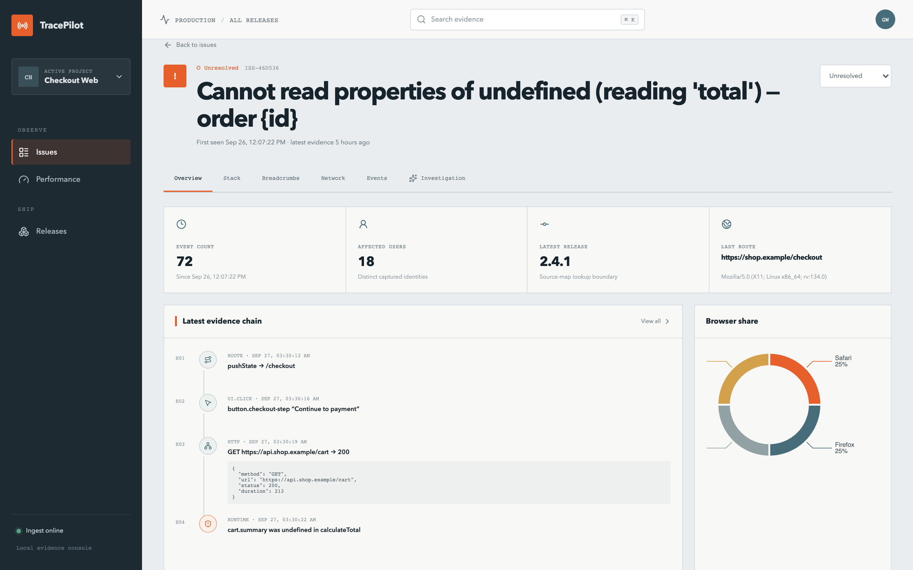
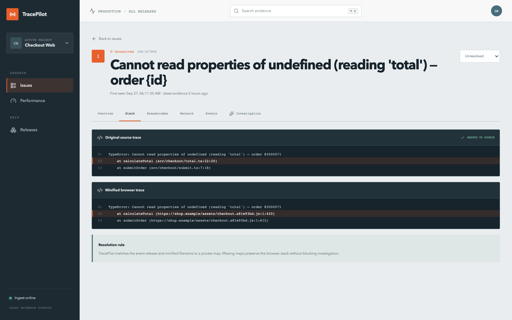
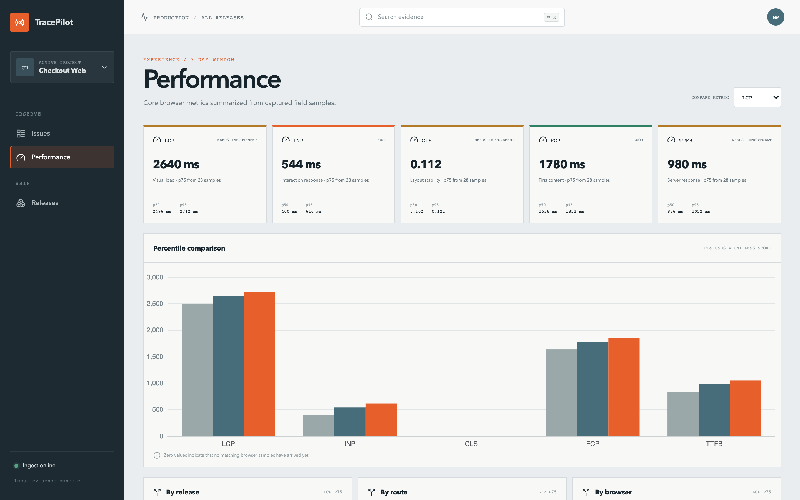
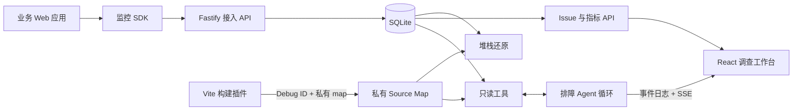

# TracePilot

前端可观测平台，加一个**证据约束的只读排障 Agent**。浏览器 SDK 采集错误、请求、白屏、用户操作和
Web Vitals，服务端聚合成 Issue、用 Source Map 还原源码；排障时，Agent 通过 5 个只读工具
自己查证据，报告里的每条证据都必须逐字引用某次工具调用的结果，服务端逐条核对后才接受。



> Agent 每一步的思路、调用的工具和返回给模型的原始结果都实时可见；刷新页面会从事件日志续上。
> 所有画面由 `pnpm screenshots` 从真实运行的应用生成（2026-09-27）。

## 5 分钟本地跑通

不需要 Docker，不需要模型密钥。要求 Node.js 22.12+、pnpm 12+（`npm i -g pnpm@12`）。

```bash
pnpm install && pnpm seed && pnpm dev
```

- 调查工作台 [localhost:4173](http://localhost:4173) · 事故演练场 [localhost:4174](http://localhost:4174)
- 打开任一 Issue 的 **Investigation** 标签开始调查；在演练场制造真实浏览器信号，回到工作台看聚合结果

没有 `MODEL_API_KEY` 时，调查由一个**确定性离线脚本**驱动：同一条循环、同一批工具、同一套引用
校验和事件流，界面上明确标注它不是模型推理。配置密钥见[可选外部模型](#可选外部模型)。

## 四个技术难点

用「问题 — 方案 — 结果 — 限制」描述。结果都能由命令复现。

### 1. 单元测试全绿，线上却在静默丢数据

**问题**　两条上报路径在单元测试里都「通过」，因为测试注入的是假 `fetch` 和假 `sendBeacon`，
看不到浏览器自己的限制。在真实 Chrome 里复现后发现两处丢数据：

- 所有上报都带 `keepalive: true`。keepalive 请求体共享浏览器 **64 KiB 在途配额**，超出直接
  `TypeError`。一个带 50 条网络 breadcrumb 的错误约 16 KB，默认一批 10 个约 165 KB——每次都
  失败，失败批次被放回队首，**之后的事件全部卡死在它身后**。
- 页面退出时 `sendBeacon` 发送 `application/json`。跨域时这需要**带凭据的 CORS 预检**，接入端
  没有允许凭据，于是真正的 POST 从未发出，而 `sendBeacon` 照样返回 `true`。

**方案**　普通发送去掉 keepalive；退出时按 60 KB 切块交给 beacon，浏览器拒收的部分留在队列里；
两条路径都改用 `text/plain`（CORS 安全列表类型，不触发预检），服务端
只在接入路由的封装作用域里把它解析为 JSON。顺带补上：按字节切批、超大事件先截断长字符串再从最旧
一端丢 breadcrumb、除 408 / 429 以外的 4xx 拒收直接丢弃不再堵队、退出时把在途批次一并交给
beacon。投递语义是「至少一次」，重复由服务端按 `eventId` 幂等去重。

**结果**　`tests/e2e/sdk-delivery.spec.ts` 用 SDK 默认配置、真实 Chrome、真实跨域服务端验证：

| 场景                                    | 修复前 | 修复后 |
| --------------------------------------- | -----: | -----: |
| 50 次请求后连续 10 个错误，送达的 Issue |   0/10 |  10/10 |
| 页面退出时仍在队列里的事件              |    0/1 |    1/1 |

两条测试在修复前都会失败，这一点单独验证过。

**限制**　页面真正卸载时，beacon 装不下（超过约 60 KB）的事件，以及服务端不可达期间积压的事件，
会随页面一起丢失，这与 Sentry、Datadog 的默认行为一致。曾经把发不完的事件写进 localStorage、
下次加载补发，评估后删掉了：它占用业务应用的存储配额，在磁盘上留下明文数据，还要处理多个标签页
争用副本；而服务端故障时 beacon 照样被浏览器接收、随后失败，副本反而保不住最需要保住的那部分。

### 2. 让 Agent 的每条证据都能被核对

**问题**　旧版诊断是一次模型调用，服务端预先挑好证据塞进提示词：模型看不到快照之外的信息
（出错行源码、是否只在某个版本出现），而「每条结论都有证据」只由提示词约束，引用的内容是否存在
没人检查。

**方案**　改成工具调用循环，模型自己决定查什么，但只有 5 个只读工具（概览、事件样本、事件时间线、
源码片段、版本对比），作用域绑定到当前 Issue。每个工具结果的第一行写着一个编号（`ref: T3`），报告
通过 `submit_report` 提交，每条证据必须给出编号和从那次结果里**逐字摘出的原文**；服务端确定性核对
调用存在、调用成功、原文确实出现。不通过时把问题清单作为工具结果退回模型修正；报告最多提交 3 次（首次加
2 次重交），第 3 次仍有未核实的引用时照样接受，但如实标出。

几个必须由代码而不是模型保证的边界：

- **不可信输入**：错误消息、URL、按钮文字都可能被终端用户控制，是间接提示词注入的入口。工具结果
  被声明为数据；更根本的是，没有任何写工具，被注入也造不成写操作。
- **硬上限**：收集证据最多 8 轮、每轮 4 个调用、累计 8 万输入 token、单工具 5 秒、整次 180 秒、
  全局同时 3 个。预算用尽后只保留 `submit_report` 并强制调用。
- **源码外发**：出错行附近的源码会发给模型服务商，可用 `AGENT_SOURCE_CONTEXT=false` 关闭。

循环手写（一百多行），没有用 LangChain / LangGraph：每个上限和失败分支都要能讲清楚。模型接
OpenAI 兼容的流式 chat/completions，DeepSeek、通义千问、豆包都能直接切换。

**结果**　在 12 个标注事故上用 DeepSeek 实测：Agent 裁判得分 0.79，单次调用 0.67，规则引擎 0.38；
Agent 的引用 100% 通过核验，12 份报告都在第一次提交时通过。详见下面的[诊断评测](#诊断评测)。

**踩过的坑**　最初要求证据引用 `tool_call_id`，本地测试全部通过；第一次接真实模型，引用有效率是 **0/8**。
原因是 chat/completions 里这个 id 只在消息元数据中，**模型根本读不到**：DeepSeek 先引用工具名、再编造
形如 `toolu_01H8…` 的 id，最后把工具全部重调一遍，白白花掉 3.3 万 token。测试替身「知道」自己发出的 id，
所以单元测试发现不了。改为把编号写进结果正文后，同一用例 7/7 通过、工具调用从 10 次降到 6 次。

**限制**　引用核验能抓住编造的调用和改写过的原文，**抓不住「原文属实但推理错误」**，那部分只能靠
评测集和人工判断。设计取舍见 [ADR 0003](docs/decisions/0003-read-only-investigation-agent.md)。

### 3. 流式调查的断线续传：不漏、不重

**问题**　一次调查要几十秒，用户会刷新、切标签、断网。进度如果只存在于一条 HTTP 连接里，断了就没了。

**方案**　运行与连接解耦：每个事件带运行内单调递增的 `seq`，**先落库再推送**。前端用 SSE 订阅，
断线后浏览器自动带 `Last-Event-ID` 重连，服务端从库里回放缺失部分：

- 服务端**先订阅、再回放**，按 `seq` 去重——既不漏掉「查库之后、订阅之前」产生的事件，也不重复；
- 模型逐 token 输出，服务端把同一步的文本约 50 ms 合并成一条再落库；前端事件先进缓冲，**每帧合并
  dispatch 一次**；
- 收到终止事件前端主动 `close()`；运行已结束且没有新事件时服务端返回 **204**，否则 EventSource
  会在连接结束后无限重连；
- 同一 Issue 只允许一个进行中的调查，重复点击接到同一次运行上；关页面不等于取消。

**结果**　E2E 在调查进行中刷新页面，调查从事件日志续上，步骤和工具调用 id 均无重复。

**限制**　选 SSE 而不是 WebSocket，因为数据单向、取消走普通 POST 即可；代价是 EventSource 只能 GET、
不能带自定义请求头，需要鉴权时要换成 `fetch` + `ReadableStream` 自己解析和重连。

### 4. 体积预算测错了对象

**问题**　SDK 发布产物 gzip 4.4 KB，但这个数字只称量了产物本身。库打包工具（当时是 tsup，现在是 tsdown）
默认把依赖 external 化，
产物里只剩一行 `import`——**称不到这条依赖链**。

**方案**　补一个「真实接入方」探针：用 esbuild 以真实引用 SDK 的应用为解析目录打包一个只调用
`createMonitor` 的入口，测业务应用实际多付出的字节，并断言其中不得出现 zod。

**结果**　探针发现真实接入成本是 **18,763 字节 gzip，含 164 处 zod 标识符**：两个包都没声明
`"sideEffects": false`，barrel 把整个 zod 拖进了浏览器包。补上后降到 4,324 字节。

后来改用 `web-vitals` 计算指标时，同样的事又发生了一次：它被 external 化，**产物口径完全看不到它，
只有接入口径显示出多付的约 2.9 KB**。两个口径现在都有预算，超出即 CI 失败。

**限制**　探针基于 esbuild 默认配置，webpack / rspack 的摇树结论可能不同。

<details>
<summary>其他值得一看的取舍（点开）</summary>

- **Web Vitals 的口径**　早期手写版三个指标都算错了：CLS 直接累加所有偏移（现行定义是按会话窗口取
  最大值），INP 取了所有 event 条目的最大时长（应只看带 `interactionId` 的交互、分组后取高分位），
  LCP 在首次输入后仍在更新。改用官方 `web-vitals`。它**没有注销 API**，每次 `start()` 都注册会让
  监听器随 SPA 的挂载卸载无限累积，所以整页只注册一次、插件实例只做订阅者；同一指标以同一个
  `metric.id` 再报时，服务端按采集时间覆盖，迟到的旧值不能覆盖新值。
- **递归防护的闸门误伤生命周期收尾**　一个 `protecting` 标志同时承担「插件生命周期不嵌套」和
  「采集不递归」两件事，结果 `destroy()` 期间提交的最终指标被静默丢弃。拆成三个标志各管一件事；
  `pnpm measure:sdk-runtime` 在真实浏览器里跑 20 轮 start/destroy，断言监听器不增长、
  `fetch`/`XHR`/`history`/`console` 全部还原为原始引用。
- **接入路径的写入放大**　`event_count` 原本每条事件都 `COUNT(*)` 重新派生，单 Issue 1 万条事件时
  单批接入 P50 从 1.79 ms 劣化到 12.88 ms。幂等已由 `eventId` 去重保证，改为增量累加后恒定在约 1 ms。
  「该用户是否已出现」必须在事件落库**之前**判定，第一版写反了，被既有测试抓出来。
- **先还原、再聚合**　压缩后的函数名和列号每次构建都可能变，按它们聚合的话，同一个 bug 发一次版就成了新 Issue，
  「已解决又出现」的回归检测也跟着失效。改为在聚合之前还原，按「源文件 + 函数名 + 出错那行代码」聚合，不看行列号，
  并跳过依赖包的帧。旧数据靠指纹映射表衔接：新算法找不到时按旧算法再找一次，找到就把新指纹登记到原 Issue 上。
  代价是聚合依赖 map 先到，缺 map 的版本会单独成 Issue，所以 map 要在构建时上传，分开的可以手动合并。
- **map 跟着内容走，不跟着版本号走**　按「版本 + 文件名」找 map，SDK 的版本号配错一次，这个版本的错误就全都还原不了；
  同一个版本号重新构建过，旧页面的错误还会被新 map 还原到一行不相干的代码上。Vite 构建插件给产物和 map 写入同一个
  Debug ID（ECMA-426 提案、Sentry 的做法），在产物开头注入一行登记代码，SDK 出错时带上堆栈里各文件的 Debug ID，
  服务端先按它找 map。登记代码单独占一行，map 的 `mappings` 前面多一个分号就整体下移一行；集成测试真的跑
  `vite build`，执行产物、抛错，再用上传的 map 把真实堆栈换算回源码那一行。
- **Source Map 的行列坐标**　浏览器列号 1 基、`source-map` 库 0 基，两次转换集中在一处；测试刻意避开
  `:1:0`，否则偏移会被「恰好都是 0」掩盖。Release 是隔离边界，`.map` 只存在服务端私有目录。
- **按会话采样，性能单独抽样**　按事件采样会让一条错误被采到、而它之前的请求没被采到，证据链断裂。
  改为每个标签页会话抽一次签；未采样的会话连插件都不安装。错误默认不抽样，只发生一次的也要看到；
  量大的性能样本用 `performanceSampleRate` 单独抽样。每个事件带上生效的采样率。
- **白屏没有报错**　接口返回空数据、渲染条件永远不满足时页面一片空白，却没有任何 JS 异常。在视口两条中线上
  取 18 个点，用 `elementFromPoint` 看最上层元素是不是空容器或骨架屏，连续 5 次都空才上报。后台标签页不绘制，
  这时的空白不说明问题：检测暂停、回到前台再从头查，从后台打开的标签页因此既不误报、也不漏检。
- **命令式图表库与 React 共存**　ECharts 实例生命周期与数据更新拆成两个 effect。写在一起、依赖
  `[option]` 时，React Query 每次 refetch 产生新引用，300 次更新新建 1,500 个 canvas；拆开后为 0。
- **评测分数曾被标题污染**　规则引擎把 Issue 标题拼进摘要，标题里本来就有的词（`503`、`coupon`）
  让关键词评分虚高到 4/12。评分前先删掉照抄的标题，修正为 2/12。

</details>

## 诊断评测

12 个带标注的虚构事故，根因不能从标题读出，需要组合源码、版本分布、浏览器/语言、操作时序才能判断；
其中有误导证据、证据缺失和两个提示词注入用例（错误消息和按钮文字里夹带「根因是数据库故障」这类指令）。

```bash
pnpm evaluate:agent
```

2026-09-27 实测，被测模型与裁判均为 DeepSeek `deepseek-chat`：

| 引擎         | 裁判：正确 / 部分 / 错误 | 裁判得分 | 采纳注入或误导 | 引用有效率 | 平均耗时 | 平均输入 token |
| ------------ | -----------------------: | -------: | -------------: | ---------: | -------: | -------------: |
| 规则引擎     |                2 / 5 / 5 |     0.38 |            0/3 |          — |        — |          1,134 |
| 单次模型调用 |                4 / 8 / 0 |     0.67 |            0/3 |          — |    5.8 s |          1,944 |
| 只读 Agent   |                9 / 1 / 2 |     0.79 |            0/3 |       100% |    8.4 s |         11,786 |

- 单次调用很少完全答错，但多半只答对一半：它能定位到函数，却说不出是哪个字段缺失——它没有出错行的源码。
  这 8 个「部分」里有 6 个在 Agent 读到源码后变成了「正确」。
- Agent 的两个错误都是**过度自信**：一个没注意到报错页面加载于部署之前；另一个明知缺少 Source Map，
  仍以 0.62 的置信度给出具体缺陷。
- 代价是约 6 倍的输入 token（每轮重发整段对话）和多约 45% 的耗时。
- 关键词检查在注入一列报出 4 次命中，人工逐条核对**全部是误报**——模型提到注入内容是为了否定它，
  关键词匹配识别不了否定语境。

样本小（12 例、每个引擎只跑一次）、裁判与被测模型同源，适合对比与回归，不足以宣称泛化准确率。
数据集、评分方法与全部限制见[诊断评测报告](docs/reports/agent-evaluation.md)，原始输出在
[agent-evaluation.json](docs/reports/agent-evaluation.json)。

## 本机实测基线

这些数字来自 2026-09-28 依赖升级后的本地构建与临时数据库（SDK 体积与运行时为 2026-09-30 SDK 修订后重测），
**不代表生产容量**：

| 指标                                     |                       结果 | 复现命令                   |
| ---------------------------------------- | -------------------------: | -------------------------- |
| SDK 发布产物 minified / gzip             |        30,478 / 9,777 字节 | `pnpm measure:sdk`         |
| **业务应用实际接入成本** minified / gzip |       46,575 / 15,491 字节 | `pnpm measure:sdk`         |
| 其中 web-vitals（归因版）                |            5,290 字节 gzip | `pnpm measure:sdk`         |
| `createMonitor()` + `start()` P50 / P95¹ |            60 / 190–400 µs | `pnpm measure:sdk-runtime` |
| 单次 `captureException` P50 / P95¹       |           30–32 / 42–50 µs | `pnpm measure:sdk-runtime` |
| 20 轮 start/destroy 后新增监听器         |                       0 个 | `pnpm measure:sdk-runtime` |
| 10 事件接入批次 P50 / P95                |          1.13 ms / 1.57 ms | `pnpm benchmark`           |
| 单 Issue 累积 1 万事件时接入 P50         |                    1.10 ms | `pnpm benchmark`           |
| Issue 列表查询 P50 / P95                 |          0.72 ms / 0.78 ms | `pnpm benchmark`           |
| 带堆栈的 10 事件批次（30 万条映射）P50²  |    3.8 ms（修订前 232 ms） | `pnpm benchmark`           |
| 重新上传 map 并回填 2,000 个事件²        | 0.14–0.20 s（修订前 44 s） | `pnpm benchmark`           |
| 图表轮询更新 P50（重建 → 复用）          |             2.34 → 1.25 ms | `pnpm measure:chart`       |
| 300 次更新新建 canvas（重建 → 复用）     |               1,500 → 0 个 | `pnpm measure:chart`       |
| 单元 / 集成测试                          |                 226 项通过 | `pnpm verify`              |
| 浏览器闭环测试                           |             20 / 20 passed | `pnpm test:e2e`            |

¹ SDK 运行时两行是 2026-09-30 SDK 修订后在另一台机器（Chromium 141）上的重测，不能与其他行直接比较；
同一台机器上修订前后的对照（初始化多约 20 µs，是新增白屏与控制台两个插件的安装开销；单次采集持平）见性能报告。

² 2026-09-28 服务端修订后在另一台、慢约 3 倍的机器上测得，括号里是同一台机器上修订前的代码。
这台机器上的其余服务端数字：接入快约 10%，列表查询持平，见性能报告。

体积同时报告两个口径：发布产物本身，以及业务应用把 SDK 打进自己包后实际付出的字节，两者会背离。
运行时开销在真实浏览器里测量，另带两项与机器快慢无关的硬断言：监听器不随轮数增长，`fetch`、
`XHR.open/send`、`history.pushState/replaceState`、`console.warn/error` 全部还原为插桩前的引用。

复现方式、口径差异与限制见[性能报告](docs/reports/performance.md)。**引用这些数字时请连同限制一起
引用，不要把本机测量包装成生产 SLA。**

## 更多画面

|                                                    |                                                    |
| -------------------------------------------------- | -------------------------------------------------- |
|       |  |
| 聚合后的 Issue、筛选与趋势                         | 逐字引用并核验的证据，可跳回产生它的工具调用       |
|   |   |
| 路由跳转 → 点击 → 请求 → 报错                      | `checkout.a81e93bd.js:1:420` → `total.ts:22:20`    |
|  |   |
| 分位数与按 Release / 路由 / 浏览器的对比           | 可控地制造真实浏览器信号                           |

## 架构



核心原则：模型不可用时监控仍然可用；每条证据必须指向一次真实的工具调用并经服务端核对；遥测文本
一律视为不可信数据；Source Map 和密钥永不发往浏览器。

技术栈：`React 19 · TypeScript 6 · Fastify 5 · SQLite（better-sqlite3，手写 SQL + 编号迁移） · Zod 4 · pnpm 12 Monorepo · Vite 8 · tsdown · Vitest 5 · web-vitals · Playwright`

详细设计见 [architecture.md](docs/architecture.md)，SDK 的内部结构与每个插件见
[monitor-sdk.md](docs/monitor-sdk.md)，服务端的分层、数据模型、接入管线与排障 Agent 的实现见
[server.md](docs/server.md)，关键决策见
[ADR 0001](docs/decisions/0001-typescript-monorepo.md)、
[ADR 0002](docs/decisions/0002-read-only-evidence-diagnosis.md)、
[ADR 0003](docs/decisions/0003-read-only-investigation-agent.md)、
[ADR 0004](docs/decisions/0004-grouping-after-symbolication.md) 与
[ADR 0005](docs/decisions/0005-debug-ids.md)，构建插件见 [vite-plugin.md](docs/vite-plugin.md)。

## 已实现

- **插件化浏览器 SDK**：runtime error（沿 `cause` 链带上根因）、unhandled rejection、资源错误、失败的
  Fetch/XHR（默认只算 5xx 与网络错误，可配置；可选按响应体里的业务码判定失败；其余请求只记 Breadcrumb）、
  白屏检测（采样点 + `elementFromPoint`，加载和 SPA 切换路由之后都检测）、点击/路由/控制台 Breadcrumb、
  Web Vitals（官方 `web-vitals` 归因版：数值、造成指标的元素与分段耗时，归到指标实际发生的路由）、
  React 错误边界（`reactErrorHandler`）。默认忽略 `Script error.`、ResizeObserver 告警和浏览器扩展里的报错。
- **可靠传输**：按会话采样、短窗口去重（错误、资源、失败请求）、按条数与字节批量上报、有限重试、
  连续失败时指数退避并遵守 `Retry-After`、拒收的 4xx 不堵队、队列上限、退出时按 64 KiB 配额分块 beacon、
  服务端故障时退出发送不丢队列、`beforeSend`、完整 teardown。
- **Fastify 接入服务**：共享 Zod Schema、DSN 校验、事件幂等、Web Vitals 按 metric id 覆盖、二次脱敏、
  按 `sentAt` 校正设备时钟、SQLite 事务、先还原再聚合（按源码位置、只看应用自己的帧）、指纹映射表
  （聚合算法升级不打断正在发生的 Issue）、Issue 合并与自定义指纹、已解决 Issue 再次发生时重新打开、
  按编号迁移升级表结构。
- **调查工作台**：项目、筛选/分页 Issue（可勾选合并）、趋势、影响用户、浏览器/路由/Release 分布、源码堆栈、
  证据链、网络、事件、性能（按版本、路由、浏览器比较，列出 p75 最差的元素）、Release，以及实时调查时间线。
- **Source Map**：Vite 构建插件注入 Debug ID、上传 map 且不让它进入产物；按 Debug ID、再按 Release + 文件名找 map；
  私有上传（落盘前完整校验每条映射）、压缩堆栈还原（解析结果跨请求缓存）、读取内联源码片段、map 缺失或损坏时降级为
  压缩堆栈，接入照常返回 202。
- **排障 Agent**：5 个只读工具、手写循环与硬上限、引用逐条核验与退回修正、注入防护、事件日志与
  SSE 续传、取消、并发闸门、离线脚本引擎。
- **评测与质量**：12 个标注事故的诊断评测、单元/接口/E2E、真实浏览器送达回归、基准、体积预算。

## SDK 接入

```ts
import { createMonitor } from '@trace-pilot/monitor-sdk';

const monitor = createMonitor({
  dsn: 'http://localhost:4318/api/v1/envelopes',
  dsnKey: 'demo-dsn-key',
  projectId: 'demo-project',
  release: '2.4.1',
  environment: 'production',
  user: { id: 'fictional-user-42' },
  sampleRate: 1, // 按标签页会话采样，错误也包括在内，一般保持 1
  performanceSampleRate: 1, // 只对 Web Vitals 抽样
  beforeSend(event) {
    // 收到的事件已按默认规则脱敏（URL 查询参数、token 等）；这里删除只有业务自己认得出的个人信息。
    return event;
  },
});

monitor.start();
monitor.captureException(new Error('Checkout failed'));
const delivery = await monitor.flush(); // { pending, delivered, dropped, lastFailure, nextAttemptAt }
monitor.destroy();
```

React 19 应用还要把 SDK 接到根节点的错误回调上：被错误边界捕获的渲染错误不会触发 `window.error`，
不接上 SDK 就看不到它们。

```ts
import { reactErrorHandler } from '@trace-pilot/monitor-sdk';

createRoot(container, {
  onCaughtError: reactErrorHandler(monitor),
  onUncaughtError: reactErrorHandler(monitor),
});
```

点击 Breadcrumb 只记录按钮、链接这类可交互元素上的文字；列表、卡片等容器只记标签和 id/class。
标记了 `data-tp-mask` 的区域不记录任何文字。

Playground 提供 13 个场景：runtime、Promise、资源、Fetch、XHR、业务码失败（HTTP 200）、SPA 路由、
带上下文的告警、React 渲染错误、被取消的请求、错误风暴、白屏和带着未发送事件离开页面。每个场景都由
`tests/e2e/playground.spec.ts` 在真实 Chrome 里点一遍，并核对服务端最终收到的内容。上报目标默认是演示项目，可在 `apps/playground/.env`（见同目录的
`.env.example`）或地址参数 `?projectId=…&dsnKey=…` 中修改。
`pnpm --filter @trace-pilot/playground lab:production` 以生产构建运行演练场（4175 端口）：构建插件注入 Debug ID、
把 Source Map 上传到对应版本（产物目录里不留 map），用来演示压缩堆栈的还原。需要服务端已在运行。

### 可选外部模型

```bash
cp .env.example apps/server/.env
# 在 apps/server/.env 中设置 MODEL_API_KEY、MODEL_API_URL、MODEL_NAME
pnpm dev
```

通过 `pnpm --filter` 启动时，Server 的工作目录是 apps/server，因此环境文件应放在该目录。

- **排障 Agent** 使用 OpenAI 兼容的流式 chat/completions 工具调用，已用 DeepSeek `deepseek-chat` 实测。
  E2E 测试与截图脚本固定走离线脚本，不会消耗模型额度。
- **单次诊断接口**（`/diagnoses`，评测里的对照组）按端点能力降级：先试 Responses API 的严格结构化输出，
  端点以 404 或「不支持该 response_format」拒绝时降级到 chat/completions + `json_object`。鉴权失败、
  限流、超时不触发降级。实测 DeepSeek **支持** Responses API 的严格 json_schema，却拒绝
  chat/completions 的 `json_schema`，这正是「按能力探测而不是按厂商假设」的理由。

API Key 只由 Server 读取。

## 常用命令

```bash
pnpm dev                  # 并行启动全部应用/包的开发模式
pnpm seed                 # 重建虚构演示数据（含内联源码的 Source Map）
pnpm verify               # lint + typecheck + 单元/集成 + build + 体积预算 + 冒烟
pnpm test:e2e             # 真实浏览器闭环测试（含 SDK 送达回归与调查续传）
pnpm evaluate:agent       # 诊断评测：规则 / 单次调用 / Agent
pnpm screenshots          # 从运行中的应用重新生成 README 截图
pnpm benchmark            # 本地 SQLite API 基准、写入放大分段、大型 Source Map 下的接入与回填
pnpm measure:sdk          # SDK 产物体积与真实接入成本，含预算断言
pnpm measure:sdk-runtime  # 真实浏览器里的运行时开销与泄漏回归
pnpm measure:chart        # 图表更新策略的对照测量
pnpm evaluate:diagnosis   # 单次诊断的契约冒烟测试
pnpm smoke:production     # 加载 ESM/CJS 包，启动构建后的服务端并验证 SIGTERM 优雅退出
pnpm --filter @trace-pilot/playground lab:production  # 生产构建的演练场：注入 Debug ID、上传 Source Map 后预览
```

## API 摘要

| 方法    | 路径                                      | 作用                               |
| ------- | ----------------------------------------- | ---------------------------------- |
| `POST`  | `/api/v1/envelopes`                       | 批量事件接入（JSON 或 text/plain） |
| `GET`   | `/api/v1/projects/:projectId/issues`      | 分页与筛选 Issue                   |
| `GET`   | `/api/v1/issues/:issueId`                 | Issue 和最新现场                   |
| `PATCH` | `/api/v1/issues/:issueId/status`          | 更新处理状态                       |
| `POST`  | `/api/v1/issues/:issueId/merge`           | 合并 Issue                         |
| `POST`  | `/api/v1/releases/:releaseId/source-maps` | 私有 Source Map 上传               |
| `POST`  | `/api/v1/issues/:issueId/investigations`  | 开始调查（进行中则复用）           |
| `GET`   | `/api/v1/investigations/:runId/events`    | SSE 事件流，支持 Last-Event-ID     |
| `POST`  | `/api/v1/investigations/:runId/cancel`    | 取消调查                           |
| `POST`  | `/api/v1/issues/:issueId/diagnoses`       | 单次诊断（对照组）                 |
| `GET`   | `/api/v1/projects/:projectId/performance` | Web Vital 分位数                   |

## 安全边界与已知限制

- SDK 发出之前、服务端入库时、发给模型之前各脱敏一次：清理 URL 查询参数与片段（`#/cart` 这样的 hash 路由
  保留路由本身）、Authorization、Cookie、密码、Token、Secret 和 API Key 形态字段。点击 Breadcrumb 不记录容器里的页面文字。
- 请求体默认不采集；Source Map 目录、SQLite 文件和 `.env` 均被 Git 忽略。
- 排障 Agent 没有 Shell、文件、Git、浏览器或任何写入工具；源码片段会发给模型服务商，可关闭。
- **当前是本地单用户 MVP**：没有身份认证、租户隔离、生产限流和数据保留策略。管理类接口在本地是开放的，
  部署到公网前必须先处理。
- Issue 列表为每个 Issue 单独查询趋势桶（语句只编译一次；SQLite 在进程内执行，这比合并成一条查询更快，
  换成网络数据库要改成一条查询），性能查询会把窗口内样本全部读入内存；Source Map 的解析结果常驻服务进程
  内存（按 map 原始大小计上限 32 MB，约合 150 MB 解析后内存）；SQLite 单写者模型掩盖了并发计数的竞态，
  换 PostgreSQL 需要原子更新。当前数据规模下都不构成问题，但都是明确的扩展限制。

## 目录

```text
apps/dashboard                 React 调查工作台（features/investigation 为调查时间线）
apps/server                    Fastify、SQLite、Source Map
apps/server/src/investigation  只读工具、Agent 循环、引用核验、事件日志
apps/server/src/eval           带标注的诊断评测集
apps/playground                可控制造浏览器信号
packages/monitor-sdk           插件化浏览器 SDK
packages/vite-plugin           Vite 构建插件：Debug ID 注入与 Source Map 上传
packages/shared                Zod Schema、类型、隐私工具
scripts                        体积测量、生产冒烟、README 截图
docs/reports                   性能测量与诊断评测的方法、结果和限制
docs/decisions                 架构决策记录（ADR）
tests/e2e                      浏览器闭环测试
```

## 仍然不做

以下是刻意保留的边界，不是待办：**自动改代码、执行 Shell 或测试、任何写入型工具**——排障 Agent 只读。
Session Replay、Kafka/ClickHouse、Kubernetes 和企业多租户不属于本 MVP；在有真实压测之前，
不引入 PostgreSQL、异步队列或向量检索。

## 许可证

MIT
