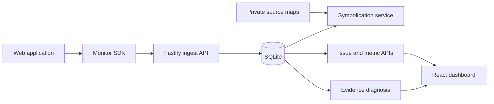

# TracePilot architecture

TracePilot turns browser telemetry into an evidence chain that a developer can inspect before asking
for a diagnosis.

## Workspace boundaries

- `packages/shared`: transport schemas, public response types, privacy helpers, and thresholds.
- `packages/monitor-sdk`: browser-only collection core and plugins.
- `apps/server`: ingestion, aggregation, queries, private source maps, and diagnosis.
- `apps/dashboard`: the investigator-facing UI.
- `apps/playground`: controlled scenarios that exercise the full telemetry path.

## Operating principles

1. Monitoring remains useful when the model provider is unavailable.
2. All model claims must point back to stored evidence.
3. Raw request bodies and common secret fields are excluded by default.
4. Releases are the boundary for source-map resolution.
5. SQLite is an MVP storage adapter, not a permanent scaling claim.
