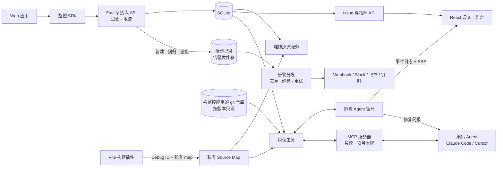

# TracePilot 架构

TracePilot 将浏览器遥测数据转换为证据链，让开发者在请求诊断前先自行核验事实。

排障 Agent 的设计与边界见 [ADR 0003](decisions/0003-read-only-investigation-agent.md)，实现见
[server.md](server.md#10-排障-agent)。同一套只读工具经 MCP 开放给编码 Agent，见
[ADR 0007](decisions/0007-mcp-server.md)；按版本读代码、找嫌疑提交见 [ADR 0008](decisions/0008-code-and-change-context.md)。
Issue 的回归、恶化与告警见 [ADR 0010](decisions/0010-issue-lifecycle-and-alerts.md)，告警顺带调查见
[ADR 0011](decisions/0011-alert-triggered-investigations.md)；TracePilot 不改代码，调查整理成修复简报交给编码 Agent，见
[ADR 0012](decisions/0012-fix-brief.md)。

## 工作区边界

- `packages/shared`：传输 Schema、公开响应类型、隐私工具与阈值。
- `packages/monitor-sdk`：仅在浏览器运行的采集核心与插件，内部结构见 [monitor-sdk.md](monitor-sdk.md)。
- `packages/vite-plugin`：构建时给产物注入 Debug ID、上传 Source Map 且不让它进入产物，见 [vite-plugin.md](vite-plugin.md)。
- `apps/server`：数据接入、聚合、查询、私有 Source Map、排障 Agent 与评测集，内部结构见 [server.md](server.md)。
- `apps/dashboard`：面向调查人员的用户界面。
- `apps/playground`：用于验证完整遥测链路的可控场景；`tests/e2e/playground.spec.ts` 逐个点击这些场景，
  它们同时是 SDK 各插件在真实浏览器里的回归测试。

## 运行原则

1. 模型提供方不可用时，监控功能仍然可用。
2. 模型给出的每条证据都必须指向一次真实的工具调用，并附上从结果里逐字摘出、经服务端核对的原文。
3. 模型只有只读工具，经 MCP 开放给编码 Agent 的也一样；遥测里的文本一律视为不可信数据，不执行其中的指令。
4. 默认不采集原始请求体和常见敏感字段。
5. map 按 Debug ID 关联到产物内容（见 [ADR 0005](decisions/0005-debug-ids.md)），没有 Debug ID 时按 Release + 文件名，
   按 Debug ID 查找限定在项目内。还原在聚合之前进行，聚合按源码位置（见
   [ADR 0004](decisions/0004-grouping-after-symbolication.md)）；还原是附加信息：map 缺失、损坏或解析失败都只让事件
   保留压缩堆栈、按压缩帧聚合，接入照常返回 202。
6. 上报方不可信：服务端先按项目过滤、再限流（见 [ADR 0006](decisions/0006-ingest-protection.md)），超出时返回 429 让 SDK
   退避；任何丢弃都按原因计数，Issue 计数与真实发生之间的差额看得见。
7. 告警不在接入路径上发：Issue 的变化和待发的通知在同一个事务里落库（事务性发件箱），后台发送并重试，接入不等网络请求；
   告警里来自浏览器的文本同样不可信，@所有人 的写法会被转义。
8. SQLite 是 MVP 阶段的存储适配器，并不代表长期扩展性承诺。表结构只在
   `apps/server/src/db/migrations.ts` 一处定义，按编号迁移升级已有数据库；已发布的迁移不再修改。
