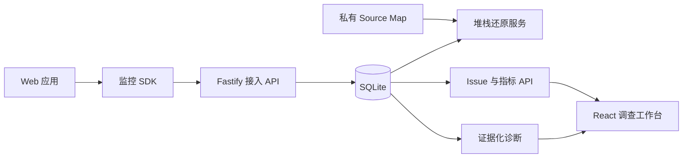

# TracePilot 架构

TracePilot 将浏览器遥测数据转换为证据链，让开发者在请求诊断前先自行核验事实。

## 工作区边界

- `packages/shared`：传输 Schema、公开响应类型、隐私工具与阈值。
- `packages/monitor-sdk`：仅在浏览器运行的采集核心与插件。
- `apps/server`：数据接入、聚合、查询、私有 Source Map 与诊断。
- `apps/dashboard`：面向调查人员的用户界面。
- `apps/playground`：用于验证完整遥测链路的可控场景。

## 运行原则

1. 模型提供方不可用时，监控功能仍然可用。
2. 模型给出的所有结论都必须能回指已存储的证据。
3. 默认不采集原始请求体和常见敏感字段。
4. Release 是 Source Map 解析的隔离边界。
5. SQLite 是 MVP 阶段的存储适配器，并不代表长期扩展性承诺。
