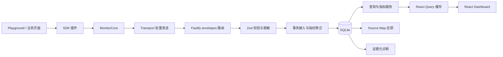

# TracePilot 代码阅读指南

这份指南面向第一次接触本项目技术栈的开发者。建议不要从头到尾逐文件阅读，而是沿着一条浏览器
事件从“产生”到“展示”的路径学习。源码中的中文注释主要解释框架机制、设计原因、安全边界和
容易踩坑的生命周期。

## 1. 先认识项目结构

TracePilot 是 pnpm workspace 管理的 TypeScript Monorepo：

| 目录                 | 技术栈                                             | 责任                                        |
| -------------------- | -------------------------------------------------- | ------------------------------------------- |
| packages/shared      | TypeScript、Zod                                    | 所有应用共享的 Schema、类型、常量和脱敏函数 |
| packages/monitor-sdk | 浏览器 API、插件模式                               | 采集错误、请求、行为和 Web Vitals           |
| apps/server          | Fastify、SQLite、Drizzle、OpenAI SDK               | 接入、聚合、查询、Source Map 和诊断         |
| apps/dashboard       | React、React Router、React Query、Zustand、ECharts | 调查工作台                                  |
| apps/playground      | React、真实 Monitor SDK                            | 制造可控浏览器信号                          |
| tests/e2e            | Playwright                                         | 验证浏览器到 Dashboard 的完整闭环           |

Monorepo 的意义是多个包在同一仓库独立构建，同时通过 workspace 依赖共享源码类型。根目录的
package.json 负责把各包命令串起来，pnpm-workspace.yaml 声明哪些目录属于工作区。

## 2. 一条事件怎样穿过系统

阅读时始终问三个问题：

1. 这一层收到的数据是否可信，在哪里校验？
2. 这一层是否改变数据，失败时怎样回滚或降级？
3. 这一层创建了监听器、定时器或外部资源，在哪里释放？

## 3. 推荐阅读顺序

### 第一步：共享契约

先看：

- [Schema](../packages/shared/src/schemas.ts)
- [公开 DTO](../packages/shared/src/types.ts)
- [隐私清理](../packages/shared/src/redaction.ts)
- [共享常量](../packages/shared/src/constants.ts)

需要理解的概念：

- TypeScript 类型只在编译期存在，无法校验网络 JSON。
- Zod Schema 在运行时检查 unknown，并可通过 z.infer 推导静态类型。
- SDK、Server 和 Dashboard 依赖同一个 shared 包，减少字段漂移。
- 客户端清理不能被信任，因此 Server 会再次脱敏。

### 第二步：从 Playground 看 SDK 怎么用

阅读 [Playground App](../apps/playground/src/App.tsx)。

重点观察：

- useEffect 创建并销毁 SDK。
- useRef 保存不参与渲染的 SDK 实例。
- 七种场景怎样触发真实 window、Promise、DOM、Fetch、XHR 和 History API。
- beforeSend 怎样成为业务侧最后的隐私闸门。

### 第三步：阅读 SDK 主链路

依次阅读：

1. [SDK 入口](../packages/monitor-sdk/src/index.ts)
2. [MonitorCore](../packages/monitor-sdk/src/core/MonitorCore.ts)
3. [插件目录](../packages/monitor-sdk/src/plugins)
4. [Transport](../packages/monitor-sdk/src/transport/Transport.ts)

MonitorCore 使用插件模式。核心只管理公共生命周期和事件队列，不需要知道 window.error 与
PerformanceObserver 的具体差异。每个插件实现 setup 和 teardown，因此可以独立启停并在测试中
隔离。

特别关注：

- start 和 destroy 为什么必须幂等。
- 全局监听器为什么要保存相同函数引用才能移除。
- NetworkPlugin 为什么要恢复被包装的 Fetch/XHR。
- Transport 为什么用 inFlight 防止并发 flush。
- 发送失败为什么把批次重新放回队列。
- 页面退出为什么优先使用 sendBeacon。

### 第四步：阅读 Server 入口与数据库

依次阅读：

1. [进程入口](../apps/server/src/index.ts)
2. [Fastify 应用工厂](../apps/server/src/app.ts)
3. [配置](../apps/server/src/config.ts)
4. [SQLite Client](../apps/server/src/db/client.ts)
5. [Drizzle Schema](../apps/server/src/db/schema.ts)

Fastify 应用使用工厂函数返回实例。测试可以调用 app.inject 而不监听端口，生产入口再调用
listen。SQLite 使用 better-sqlite3 的同步事务；Drizzle 提供类型安全写入，复杂统计仍使用
prepared SQL。

需要分清：

- client.ts 的 DDL 真正创建表。
- schema.ts 为 Drizzle 提供 TypeScript 列类型。
- 这两处结构必须同步；正式项目通常改为版本化 migration。
- WAL 提高本地读写并发，但 SQLite 仍不是无限水平扩展的生产数据库。

### 第五步：跟踪事件接入与聚合

依次阅读：

1. [事件 HTTP 路由](../apps/server/src/routes/events.ts)
2. [事件接入服务](../apps/server/src/services/events.ts)
3. [指纹算法](../apps/server/src/lib/fingerprint.ts)

关键流程：

1. Zod 校验整个 envelope。
2. DSN Key 找到授权项目。
3. eventId 检查幂等。
4. 服务端二次脱敏。
5. Release 不存在时惰性创建。
6. 动态 ID 归一化后生成 SHA-256 指纹。
7. 相同指纹更新同一个 Issue。
8. 事件和聚合在同一个 SQLite 事务中提交。

性能事件不会创建 Issue；成功网络事件只提供上下文；错误、资源失败和失败请求才进入问题流。

### 第六步：阅读查询与 Dashboard

先看 [查询服务](../apps/server/src/services/queries.ts)，再看：

1. [Dashboard 入口](../apps/dashboard/src/main.tsx)
2. [路由](../apps/dashboard/src/App.tsx)
3. [API Client](../apps/dashboard/src/services/api.ts)
4. [Issues 页面](../apps/dashboard/src/pages/IssuesPage.tsx)
5. [Issue 详情](../apps/dashboard/src/pages/IssueDetailPage.tsx)
6. [Performance 页面](../apps/dashboard/src/pages/PerformancePage.tsx)

React Query 管理“来自 Server 的状态”，Zustand 只保存紧凑行等本地偏好。两者不要混用：

- useQuery 读取并按 queryKey 缓存。
- useMutation 执行写操作。
- invalidateQueries 在写成功后让相关读取重新请求。
- URLSearchParams 保存可分享的筛选状态。
- useMemo 保持 ECharts option 引用稳定。
- useEffect 管理 DOM、键盘或 ECharts 等外部副作用。

### 第七步：阅读高级能力

Source Map：

- [上传路由](../apps/server/src/routes/sourcemaps.ts)
- [还原服务](../apps/server/src/services/sourcemaps.ts)
- [Release 页面](../apps/dashboard/src/pages/ReleasesPage.tsx)

诊断：

- [诊断路由](../apps/server/src/routes/diagnosis.ts)
- [诊断服务](../apps/server/src/services/diagnosis.ts)

Source Map 的关键是 Release 和压缩文件 basename 同时匹配。浏览器列号从 1 开始，而 source-map
库使用从 0 开始的列号。

诊断上下文有明确数量上限，调用模型前再次脱敏，并由 Zod 验证结构化结果。Prompt 版本和证据
JSON 一起计算输入哈希，相同上下文可直接命中缓存。

### 第八步：用测试反向理解需求

推荐顺序：

- [SDK 核心单测](../packages/monitor-sdk/src/core/MonitorCore.test.ts)
- [传输单测](../packages/monitor-sdk/src/transport/Transport.test.ts)
- [Server 接口测试](../apps/server/src/app.test.ts)
- [外部模型适配测试](../apps/server/src/services/diagnosis.external.test.ts)
- [E2E 测试](../tests/e2e/tracepilot.spec.ts)

Vitest 适合快速单元与接口测试；happy-dom 在 Node 中模拟浏览器 API；Playwright 启动真实 Chromium
验证完整用户路径。测试名称通常就是最精炼的业务约束。

## 4. 常见 TypeScript 语法

| 语法        | 本项目中的意义                                  |
| ----------- | ----------------------------------------------- |
| import type | 只导入类型，构建后不会产生运行时代码            |
| 泛型 T      | 让函数在保留调用方具体类型的同时复用实现        |
| as const    | 把普通字符串数组收窄为字面量联合类型            |
| z.infer     | 从 Zod Schema 推导 TypeScript 类型              |
| Pick / Omit | 从已有接口挑选或排除字段                        |
| Required    | 把可选字段变成必填，常用于应用默认值之后        |
| 可选链 ?.   | 左侧为 null/undefined 时安全返回 undefined      |
| 空值合并 ?? | 只在 null/undefined 时使用默认值，不把 0 当成空 |
| 类型守卫    | 用 typeof、instanceof 或枚举判断缩小 unknown    |

## 5. 常见框架概念

### React

- 组件函数根据 props/state 描述 UI。
- useState 保存会影响渲染的状态。
- useRef 保存 DOM 或不需要触发渲染的可变对象。
- useEffect 连接 React 与浏览器外部世界，并返回 cleanup。
- React Router 根据 URL 选择页面，Outlet 渲染嵌套路由。

### React Query

- queryKey 相当于缓存地址，参数变化应反映在 key 中。
- staleTime 决定多久内数据可直接复用。
- mutation 不应默认重试有副作用的写操作。
- 写入成功后优先失效缓存，再从 Server 获取真实结果。

### Fastify

- register 安装插件和路由。
- request/reply 是每次 HTTP 请求的上下文。
- setErrorHandler 是统一异常出口。
- addHook 在应用生命周期的特定时机释放资源。
- app.inject 不占端口也能经过完整路由栈。

### SQLite 与 Drizzle

- prepared statement 用占位符绑定用户值，避免 SQL 注入。
- transaction 保证一批写入原子性。
- 索引加速常用筛选，但会增加写入成本。
- 唯一索引同时表达业务不变量和并发兜底。
- Drizzle 不是数据库，它是带类型的 SQL/Schema 工具。

## 6. 调试时从哪里开始

| 现象               | 首先查看                                            |
| ------------------ | --------------------------------------------------- |
| 浏览器没有上报     | Playground 控制台、MonitorCore、Transport           |
| 出现重复请求       | NetworkPlugin teardown、Transport inFlight          |
| Server 拒绝事件    | envelopeSchema、events 路由、DSN/projectId          |
| 同一错误没有聚合   | normalizeMessage、eventFingerprint                  |
| Dashboard 筛选异常 | URLSearchParams、queryKey、listIssues               |
| 指标为 0           | PerformancePlugin、性能样本时间窗、percentile       |
| Source Map 不命中  | Release、normalizeMinifiedFile、堆栈行列            |
| 诊断失败           | buildDiagnosisContext、模型响应 Schema、Server 日志 |

## 7. 建议的学习方式

1. 运行 pnpm dev，同时打开 Playground 和 Dashboard。
2. 在一个插件的 setup、captureEvent、ingestEnvelope 和页面查询处分别打断点。
3. 只触发一个 Captured warning，观察同一 eventId 的完整旅程。
4. 再触发 Fetch 503，比较网络事件和 Breadcrumb 的区别。
5. 阅读对应单测，把注释中的设计原因与断言一一对应。
6. 最后运行 pnpm verify，理解 lint、typecheck、test、build 和 production smoke 各自防什么问题。

代码注释是导航，不是替代实现本身。遇到注释与代码行为冲突时，以测试和运行结果为准，并同步
更新注释。
