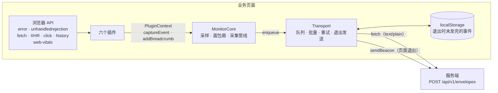
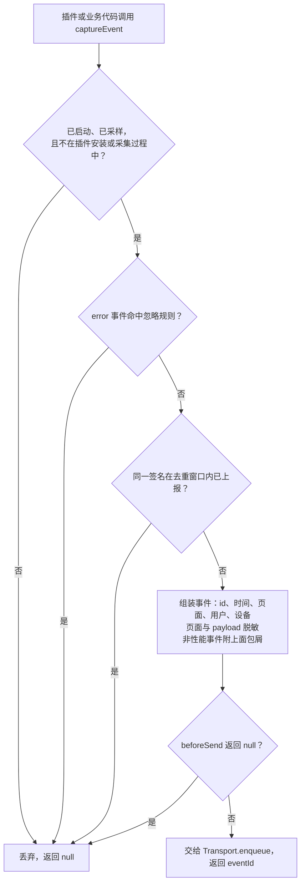
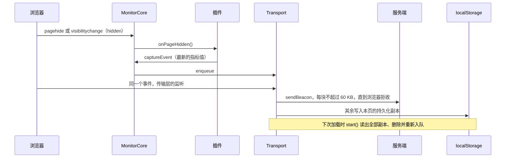
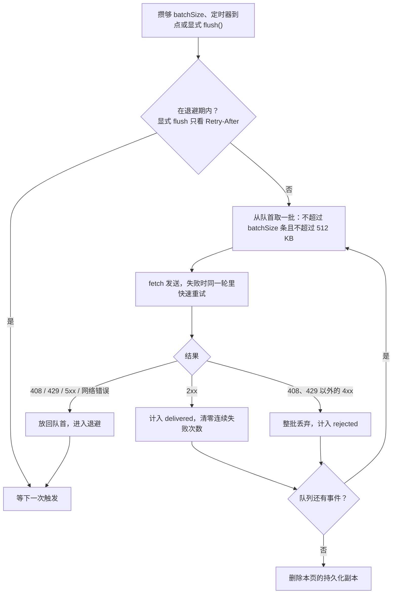

# Monitor SDK 技术架构

`packages/monitor-sdk` 是运行在业务页面里的浏览器 SDK：采集错误、失败的请求、资源加载失败、用户操作和
Web Vitals，脱敏之后批量上报到服务端的 `POST /api/v1/envelopes`。本文描述它的内部结构、每个插件的实现、
传输层的投递语义，以及与服务端的约定。事件信封的字段定义见 [event-schema.md](event-schema.md)。

## 1. 设计原则

SDK 运行在别人的页面里，所以每一条设计都先回答「会不会影响宿主页面」：

1. **不拖累宿主页面**：采集路径同步且便宜；插件抛出的异常被核心隔离；包装过的全局 API（`fetch`、
   `XMLHttpRequest`、`history`）在销毁时还原；队列长度、单个事件、每批大小、持久化副本都有上限。
2. **只上报会形成 Issue 的信号**：成功和被取消的请求只记成面包屑；默认忽略无法诊断的噪声；同类信号
   短窗口去重；性能样本不携带面包屑。同一个会话（3 次路由、5 次点击、30 个成功请求、1 个错误）的上报
   因此从 33 个事件、182,725 字节降到 3 个事件、10,186 字节。
3. **默认脱敏**：数据离开页面之前已按与服务端相同的规则处理，`beforeSend` 收到的就是脱敏后的事件。
4. **投递可靠**：语义是「至少一次」，重复由服务端按 `eventId` 去重。处理了浏览器真实的限制：
   keepalive / beacon 共享 64 KiB 在途配额、`application/json` 跨域需要预检、页面随时可能卸载。
5. **生命周期对称**：`start()` / `destroy()` 幂等，适配 SPA 的挂载卸载和 React StrictMode 的重复生命周期；
   反复 20 轮 start / destroy 后没有残留的事件监听器。

体积（`pnpm measure:sdk`，gzip）：发布产物 7,321 字节；业务应用打包后实际多付出 10,596 字节，
其中 `web-vitals` 约 2,929 字节。

## 2. 代码结构

```text
packages/monitor-sdk/
├── src/
│   ├── index.ts                  createMonitor 与全部导出
│   ├── types.ts                  公开类型：配置、插件接口、投递状况、MonitorClient
│   ├── core/
│   │   ├── MonitorCore.ts        生命周期、采样、面包屑、采集管线、页面隐藏通知
│   │   ├── options.ts            数字配置的默认值与上下界（唯一一份）
│   │   ├── noise.ts              噪声过滤与去重签名
│   │   └── helpers.ts            事件 id、页面与设备上下文、会话采样、栈首帧
│   ├── plugins/
│   │   ├── ErrorPlugin.ts        window error：运行时异常
│   │   ├── PromisePlugin.ts      unhandledrejection：未处理的 Promise 拒绝
│   │   ├── ResourcePlugin.ts     捕获阶段的 error：图片、脚本、样式、媒体加载失败
│   │   ├── NetworkPlugin.ts      包装 fetch 与 XHR：请求面包屑与失败请求事件
│   │   ├── BehaviorPlugin.ts     点击与路由面包屑
│   │   └── PerformancePlugin.ts  Web Vitals（官方 web-vitals 库）
│   ├── integrations/
│   │   └── react.ts              reactErrorHandler：接 React 19 根节点的错误回调
│   └── transport/
│       └── Transport.ts          队列、批量、重试与退避、页面退出发送、持久化补发
└── test/                         与 src/ 一一对应的单元测试，setup.ts 为公共替身
```

脱敏规则（`redactSensitive`、`redactStack`、`redactPayload`）和默认值常量不在 SDK 里，而在
`packages/shared`：服务端入库时用的是同一份规则。

## 3. 总体架构



职责按层划分：

- **插件**只知道浏览器信号怎么采。它们拿到的是一个窄接口 `PluginContext`（采集入口和只读配置），碰不到
  传输层和核心的内部状态。
- **MonitorCore** 决定信号能不能成为事件：采样、过滤、去重、补上下文、脱敏、`beforeSend`，并管理插件和
  传输层的生命周期。
- **Transport** 只负责把事件送到服务端，不理解事件语义：排队、按条数和字节切批、重试与退避、页面退出时
  交给 beacon、发不完的写进 localStorage 下次补发。

## 4. 公开 API

### 4.1 创建

```ts
import { createMonitor } from '@trace-pilot/monitor-sdk';

const monitor = createMonitor({
  dsn: 'https://api.example.com/api/v1/envelopes',
  dsnKey: 'public-dsn-key',
  projectId: 'checkout-web',
  release: '2.4.1',
  environment: 'production',
});
monitor.start();
```

`createMonitor` 等价于 `new MonitorCore(options)` 依次 `use` 六个默认插件：ErrorPlugin、PromisePlugin、
ResourcePlugin、NetworkPlugin、PerformancePlugin、BehaviorPlugin。需要按需组合时，可以直接用导出的
`MonitorCore` 和各个插件类：

```ts
import { ErrorPlugin, MonitorCore, NetworkPlugin } from '@trace-pilot/monitor-sdk';

const monitor = new MonitorCore(options).use(new ErrorPlugin()).use(new NetworkPlugin());
monitor.start();
```

### 4.2 配置项

| 选项            | 必填 | 默认值         | 取值范围                              | 说明                                                 |
| --------------- | :--: | -------------- | ------------------------------------- | ---------------------------------------------------- |
| `dsn`           |  是  | —              | —                                     | 接入接口的完整 URL                                   |
| `projectId`     |  是  | —              | —                                     | 事件所属项目                                         |
| `release`       |  是  | —              | —                                     | 当前构建的版本号，必须与上传 Source Map 时填的一致   |
| `environment`   |  是  | —              | `development` / `test` / `production` |                                                      |
| `dsnKey`        |  否  | 同 `projectId` | —                                     | 公开的接入键，不是密钥                               |
| `sampleRate`    |  否  | 1              | 0–1                                   | 按标签页会话采样的比例                               |
| `batchSize`     |  否  | 10             | 1–100                                 | 队列攒够这么多条立即发送                             |
| `flushInterval` |  否  | 5,000 ms       | 100 ms–24 h                           | 定时发送间隔；连续失败时在此基础上指数退避           |
| `maxRetries`    |  否  | 2              | 0–10                                  | 一批失败后同一轮里的快速重试次数（100、200 ms……）    |
| `maxQueueSize`  |  否  | 1,000          | 10–10,000                             | 队列上限，满了之后丢弃新到的事件                     |
| `dedupeWindow`  |  否  | 5,000 ms       | 0–10 min                              | 同类信号的去重窗口，见第 7 节                        |
| `persistence`   |  否  | `true`         | —                                     | 页面退出时发不完的事件是否写入 localStorage 下次补发 |
| `ignoreErrors`  |  否  | `[]`           | —                                     | 额外忽略的错误：字符串按「消息包含」，正则按消息测试 |
| `user`          |  否  | —              | —                                     | `{ id?, anonymousId? }`，之后可用 `setUser` 修改     |
| `beforeSend`    |  否  | —              | —                                     | 最后一道业务侧闸门：修改事件，或返回 `null` 取消     |

数字选项在 `core/options.ts` 统一规范化：超出范围的夹到边界并取整，`NaN`、`Infinity` 或缺省时用默认值；
`sampleRate` 同样夹在 0–1 之间（不取整），缺省或非法时为 1。默认值来自 `packages/shared/src/constants.ts`。

### 4.3 MonitorClient

| 方法                                | 说明                                                                         |
| ----------------------------------- | ---------------------------------------------------------------------------- |
| `use(plugin)`                       | 注册插件，同名只注册一次；`start()` 之后注册的会立即安装                     |
| `start()`                           | 安装插件并启动传输层；幂等。未被采样的会话什么都不安装                       |
| `setUser(user?)`                    | 之后的事件带上这个用户；服务端据此统计受影响用户数                           |
| `captureException(error, context?)` | 上报一个异常，返回 `eventId`；被过滤、去重或取消时返回 `null`                |
| `captureMessage(message, level?)`   | 上报一条消息，`level` 默认 `info`                                            |
| `captureEvent(eventType, payload)`  | 底层采集入口，插件和上面两个方法都经过它                                     |
| `addBreadcrumb(breadcrumb)`         | 加一条自定义面包屑                                                           |
| `flush()`                           | 立即尝试发送队列，返回投递状况 `DeliveryStats`；服务端不可达时也会正常返回   |
| `stats()`                           | 当前投递状况                                                                 |
| `destroy()`                         | 逆序卸载插件、交出剩余事件、停止传输层；幂等。销毁后的实例不能再次 `start()` |

`DeliveryStats` 用来判断事件是否真的到了服务端，而不是把 `flush()` resolve 当成「已送达」：

| 字段                | 含义                                                                    |
| ------------------- | ----------------------------------------------------------------------- |
| `pending`           | 还在队列里等待发送的事件数                                              |
| `delivered`         | 服务端已确认接收（2xx）的事件数                                         |
| `dropped.queueFull` | 队列已满时到达、被丢弃的新事件                                          |
| `dropped.oversize`  | 裁剪之后仍超过单事件上限的事件                                          |
| `dropped.rejected`  | 被服务端明确拒收（408、429 以外的 4xx）的批次里的事件                   |
| `dropped.overflow`  | 失败批次放回队列后超出上限、被裁掉的事件                                |
| `lastFailure`       | 最近一次失败的时间和状态码；`status` 为 `null` 表示没拿到响应（离线等） |
| `nextAttemptAt`     | 正在退避时，下一次自动发送的最早时间；否则为 `null`                     |

## 5. 核心：MonitorCore

### 5.1 生命周期

**构造**：规范化配置；决定本会话是否被采样；创建 Transport（`persistence: false` 时不给它存储）；
准备交给插件的 `PluginContext`。

**采样**按标签页会话一次性决定：按事件采样会让一个错误被采到、而它之前的请求没被采到，证据链断裂。
决定以 `<采样率>|<0 或 1>` 的形式写进 sessionStorage 的 `tracepilot:sampled:<projectId>`，刷新页面后保持
一致；采样率变化时重新决定；sessionStorage 不可用时退化为按页面加载决定。未被采样的会话不安装任何插件、
不注册任何监听，宿主页面完全不承担采集的开销。

**`start()`**，幂等，销毁后调用无效：

1. 未被采样就直接返回。
2. 注册核心自己的 `pagehide` 和 `visibilitychange` 监听（见 5.5）。
3. 按注册顺序安装插件。
4. 启动传输层：补发上次退出时留下的事件、开始定时发送、注册退出发送的监听。

**`destroy()`**，幂等：按注册的**逆序**卸载插件，卸载期间放行采集（PerformancePlugin 在这时提交最后的
指标）；移除核心的监听；最后销毁传输层，它会把队列里剩下的事件交给退出发送。插件都卸载完才销毁传输层，
所以插件在 teardown 里提交的事件一定赶得上。

### 5.2 三个状态标志

生命周期和采集之间有三种互不相同的「不能重入」，各用一个标志：

| 标志              | 防的是什么                                                                                   |
| ----------------- | -------------------------------------------------------------------------------------------- |
| `protecting`      | 插件的生命周期代码（setup、teardown、onPageHidden）互相嵌套执行                              |
| `suppressCapture` | 插件安装过程中顺带产生的信号：那是 SDK 自己的副作用，不是业务事件，丢弃。teardown 时不设置它 |
| `capturing`       | 采集过程中再次采集，例如 `beforeSend` 里又调用了 `captureException`，否则会无限递归          |

早期只有 `protecting` 一个标志，既防生命周期嵌套，又在所有生命周期里屏蔽采集，结果 `destroy()` 期间
提交的最终 Web Vitals 被静默丢弃。

`protect()` 包住所有插件生命周期调用：插件抛出的异常被吞掉，不影响其他插件和宿主页面。

### 5.3 采集管线



组装事件时：

- `eventId`：优先 `crypto.randomUUID()`；`timestamp`：`Date.now()`，服务端会按 `sentAt` 校正设备时钟。
- `page`：`url`（`location.href`）、`route`（路径加 hash）、`title`、`referrer`，整体脱敏。
- `device`：`userAgent`、`language`、视口宽高。
- `payload`：按 `redactPayload` 脱敏，堆栈字段保留行列号（见第 8 节）。
- `breadcrumbs`：性能事件为空数组，其余事件带上当前面包屑的副本。

去重放在组装之前，错误风暴里被挡下的重复几乎没有开销。组装、`beforeSend` 和入队时抛出的异常都只让这次
采集返回 `null`，不会传到业务代码。

两个便捷方法：`captureException(error, context)` 的 payload 是错误的 `name`、`message`、`stack`，加上
`context`，`level` 固定为 `error`；`captureMessage(message, level)` 的 payload 是
`{ name: 'Message', message, level }`。

### 5.4 面包屑

面包屑是 Issue 的证据链：报错之前用户做了什么、发了哪些请求、路由怎么变的。

- 环形缓冲区，最多 50 条（`MAX_BREADCRUMBS`），超出时丢最旧的。
- 加入时脱敏一次、分配 id、缺省时间为当前时刻；之后随多个事件发送，不必重复处理。
- 来源：NetworkPlugin 的请求（`network` / `http`）、BehaviorPlugin 的点击（`click` / `ui.click`）和
  路由（`navigation` / `route`），以及业务代码的 `addBreadcrumb`。
- 性能样本不属于任何 Issue，不携带面包屑：带上 50 条只会让每个样本大几十倍。

### 5.5 页面隐藏通知

有些插件要在页面离开之前提交数据（PerformancePlugin 的 LCP、CLS、INP 最新值），而传输层在同一时刻要把
队列交给 beacon。两者的先后决定数据赶不赶得上这次发送：



同一事件上的监听器按注册顺序执行，核心的监听在 `start()` 里早于传输层注册，所以插件提交的数据一定排在
退出发送之前。这也是插件应该实现 `onPageHidden`、而不是自己监听 `pagehide` 的原因：自己注册的监听器
可能排在传输层之后。

## 6. 事件模型

### 6.1 哪些信号成为事件

| 信号                                             | 结果                             | 来源                |
| ------------------------------------------------ | -------------------------------- | ------------------- |
| 运行时异常                                       | `error` 事件                     | ErrorPlugin         |
| 未处理的 Promise 拒绝                            | `error` 事件                     | PromisePlugin       |
| React 错误边界捕获的渲染错误                     | `error` 事件（带组件栈）         | `reactErrorHandler` |
| `captureException` / `captureMessage`            | `error` 事件                     | 业务代码            |
| 图片、脚本、样式表、媒体加载失败                 | `resource` 事件                  | ResourcePlugin      |
| 状态码不在 200–399、或网络错误的请求             | `network` 事件，同时记一条面包屑 | NetworkPlugin       |
| 成功的请求、被取消的请求、no-cors 的 opaque 响应 | 只记面包屑                       | NetworkPlugin       |
| 点击、路由变化                                   | 只记面包屑                       | BehaviorPlugin      |
| LCP、CLS、INP、FCP、TTFB                         | `performance` 事件（不带面包屑） | PerformancePlugin   |
| `Script error.`、ResizeObserver 告警、扩展报错   | 丢弃                             | 核心的忽略规则      |

### 6.2 各类 payload

| 事件             | payload 字段                                                                                               |
| ---------------- | ---------------------------------------------------------------------------------------------------------- |
| 运行时异常       | `name`、`message`、`stack`、`filename`、`line`、`column`、`level: 'error'`                                 |
| Promise 拒绝     | `name`、`message`、`stack`（reason 是 Error 时）、`mechanism: 'unhandledrejection'`、`level`               |
| React 渲染错误   | 同 `captureException`，另加 `mechanism: 'react'`、`componentStack`（最多 2,000 字符）                      |
| `captureMessage` | `name: 'Message'`、`message`、`level`                                                                      |
| 资源加载失败     | `url`、`tagName`、`resourceType`、`message: 'Failed to load <url>'`                                        |
| 失败的请求       | `method`、`url`、`status`（网络错误时为 0）、`duration`、`success: false`、`error`（fetch 网络错误的消息） |
| 性能样本         | `metric`、`value`、`rating`、`metricId`、`navigationType`                                                  |

非 Error 的 reason 也能稳定序列化：字符串成为 `message`；其他值用 `JSON.stringify` 转成文本，失败时用
`String()`，`name` 为 `UnknownError`。

事件信封与每个字段的长度上限见 [event-schema.md](event-schema.md)，权威定义在
`packages/shared/src/schemas.ts`。

## 7. 噪声过滤与去重

规则在 `core/noise.ts`。被过滤的信号不会形成事件，也就不会变成 Issue、不会进入排障 Agent 的证据。

### 7.1 忽略规则

只作用于 `error` 事件，内置规则始终生效：

| 规则                    | 判断方式                                                                           |
| ----------------------- | ---------------------------------------------------------------------------------- |
| `Script error.`         | 跨域脚本没带 `crossorigin` 时浏览器只给这一句，没有消息、堆栈和位置，无法诊断      |
| ResizeObserver 循环告警 | `ResizeObserver loop limit exceeded` / `…completed with undelivered notifications` |
| 浏览器扩展报错          | 出错文件（没有时看栈顶帧）是 `chrome-extension://`、`moz-extension://` 等          |
| `ignoreErrors`          | 接入方追加：字符串按「消息包含」，正则按消息测试                                   |

### 7.2 去重签名

| 事件类型      | 签名                                       | 说明                                                                 |
| ------------- | ------------------------------------------ | -------------------------------------------------------------------- |
| `error`       | 错误名、消息、栈首帧（行列号替换成占位符） | 同时兼容 V8 的 `at fn (url:1:2)` 与 Firefox / Safari 的 `fn@url:1:2` |
| `resource`    | 标签名、地址模式                           | 地址模式去掉查询和片段，并把数字串统一成 `0`                         |
| `network`     | 请求方法、地址模式、状态码                 | 同一接口的另一种失败是新的证据                                       |
| `performance` | 不去重                                     | 同一指标的新值必须送达，服务端按 `metricId` 覆盖                     |

地址模式让 `/thumbs/product-17.png` 与 `/thumbs/product-18.png`、`/api/orders/1001` 与 `/api/orders/1002`
视为同一处：一整页坏掉的缩略图只上报一次。

### 7.3 窗口语义

同一签名在窗口内只上报第一次，**窗口从上一次上报算起**，被挡下的重复不刷新时间。一直在发生的问题每个窗口
至少上报一次：默认 5 秒窗口下，每 3 秒触发一次的错误在第 0、6、12 秒各上报一次。早期实现每次出现都刷新
窗口，这样的错误只在第一次被上报，服务端看到的 Issue 像是早就不再发生。

签名表按实例保存，过期（超过两个窗口）的签名在每次记录新签名时顺带清理，长时间打开的页面不会无限增长。

## 8. 隐私与脱敏

### 8.1 规则

规则在 `packages/shared/src/redaction.ts`，SDK 发出之前和服务端入库时用的是同一份：

- **敏感字段**：键名包含 `authorization`、`cookie`、`password`、`passwd`、`secret`、`token`、`api_key` /
  `api-key` / `apikey`（不区分大小写，`accessToken`、`clientSecret` 也算）的，值整体替换为 `[REDACTED]`。
- **地址字段**：`url`、`href`、`referrer`、`route`、`endpoint`、`requestUrl` 等键的值去掉查询参数和片段。
- **文本**：嵌在文字里的 URL 同样去掉查询参数和片段；`Bearer xxx` 和 `?token=`、`&key=` 这类参数值被遮蔽。
- **堆栈**（`redactStack`）：栈帧只删掉文件名与 `:行:列` 之间的查询参数，保留行列号。通用的文本规则会把
  `app.js?v=3:1:420)` 从问号起整段删掉，服务端就无法再用 Source Map 还原这一帧。其余行（错误消息）按文本规则。
- 嵌套深度超过 8 层的部分替换为 `[Max depth]`，防止恶意构造的超深对象拖慢页面。

### 8.2 在哪里执行

| 数据             | 时机                                                   |
| ---------------- | ------------------------------------------------------ |
| 页面上下文       | 组装事件时                                             |
| payload          | 组装事件时，`stack` 与 `componentStack` 按堆栈规则     |
| 面包屑           | 加入缓冲区时，一次                                     |
| 业务侧的个人信息 | `beforeSend`：规则认得出 token，认不出「这是客户邮箱」 |

服务端不信任客户端，入库时和发给模型之前还会各做一遍。

### 8.3 不采集的内容

- 请求和响应的 body、headers：NetworkPlugin 只记方法、地址、状态码和耗时。
- 用户输入：点击勾选框、单选框只记 `name`，不记选中状态；下拉框只记 `name`，不记选中的值。
- 容器里的页面文字：点击描述只从按钮、链接这类可交互元素上取文字，标了 `data-tp-mask` 的区域一个字都不记
  （规则见 10.5）。

## 9. 传输层：Transport

### 9.1 上限与常量

| 常量                       | 值         | 作用                                                             |
| -------------------------- | ---------- | ---------------------------------------------------------------- |
| `DEFAULT_MAX_EVENT_BYTES`  | 32,000 B   | 单个事件序列化后的上限，保证任何一个事件都能单独放进一次退出发送 |
| `DEFAULT_MAX_BATCH_BYTES`  | 512,000 B  | 普通批次上限，低于服务端 1 MiB 的请求体限制                      |
| `KEEPALIVE_BUDGET_BYTES`   | 60,000 B   | 退出发送每块的上限：keepalive 与 beacon 共享 64 KiB 在途配额     |
| `DEFAULT_MAX_STORED_BYTES` | 256,000 B  | 写入 localStorage 的持久化副本上限                               |
| `MAX_PAYLOAD_STRING`       | 4,000 字符 | payload 里超过这个长度的字符串（通常是异常栈）先被截断           |
| `MAX_BACKOFF_MS`           | 5 分钟     | 自动发送退避的上限                                               |
| `MAX_RETRY_AFTER_MS`       | 10 分钟    | 服务端 `Retry-After` 的上限，防止异常值让 SDK 长时间停摆         |

字节数都按 UTF-8 计算（浏览器配额按字节计，而 `string.length` 是 UTF-16 码元数）。

### 9.2 入队

1. 队列已满（`maxQueueSize`）就丢弃**新到的**事件、计入 `queueFull`：事故最早的证据诊断价值最高。容量判断在
   序列化之前，风暴中被拒的事件不付出 `JSON.stringify` 的开销。
2. 序列化一次并算出字节数，之后切批和拼请求体都复用。超过 32,000 字节时依次：
   - 截断 payload 里超过 4,000 字符的字符串，标记 `truncated: true`；
   - 从最旧的一端每轮丢掉四分之一的面包屑，标记 `trimmedBreadcrumbs`——离报错最近的操作最有诊断价值；
   - 仍然超限就放弃这个事件，计入 `oversize`。
3. 队列达到 `batchSize` 时触发一次自动发送。采集 API 保持同步，不让业务代码等网络。

排障 Agent 读取事件时会看到这两个标记，知道证据被裁剪过。

### 9.3 批量发送与重试



- **一次只有一个排空循环**：定时器、攒够一批和显式 `flush()` 都复用它，循环直到队列为空。
- **请求体**直接拼接入队时缓存的 JSON，加上 `dsnKey` 和发送时刻 `sentAt`。
- **普通发送不带 keepalive**：keepalive 请求体共享 64 KiB 在途配额，超出直接失败。早期实现给所有请求都加了
  keepalive，一批 10 个带完整面包屑的错误约 165 KB，每次都失败，失败批次放回队首，后面的事件全部堵住。
- **`text/plain;charset=UTF-8`**：它在 CORS 安全列表里，跨域上报不触发预检；服务端只在接入路由里把它解析成 JSON。
- **用原生 fetch**：传输层在构造时保存了绑定好的 `window.fetch`，那时 NetworkPlugin 还没有包装它，SDK 自己的
  上报不会被记成请求面包屑。
- **快速重试**只为扛过瞬时抖动：最多 `maxRetries` 次，间隔 100 ms、200 ms、400 ms……
- **429 或带 `Retry-After` 的响应**不做快速重试：马上重试只会再被拒。

| 结果                    | 处理                                                                                |
| ----------------------- | ----------------------------------------------------------------------------------- |
| 2xx                     | 计入 `delivered`，清零连续失败次数和退避，继续下一批                                |
| 408、429 以外的 4xx     | 请求本身不被接受，重试也不会成功：整批丢弃、计入 `rejected`，继续下一批，不堵住队列 |
| 408、429、5xx、网络错误 | 放回队首（超出上限的部分从队尾裁掉、计入 `overflow`），进入退避，本轮结束           |

### 9.4 退避

连续失败时，下一次**自动**发送不早于：

```text
min(5 分钟, flushInterval × 2^(连续失败次数 − 1)) × 随机系数（0.5～1）
```

随机系数让同时遇到故障的大量页面错开重试，恢复的那一刻不会一拥而上。服务端给了 `Retry-After`（秒数或 HTTP
日期，最多 10 分钟）时，取它和退避中较晚的一个。业务代码显式调用 `flush()` 时不受退避约束，但仍然遵守
`Retry-After`。跨域的 SDK 能读到 `Retry-After`，是因为服务端在 CORS 的 `Access-Control-Expose-Headers`
里暴露了它。

### 9.5 页面退出

`pagehide` 和 `visibilitychange`（hidden）都会触发退出发送。卸载随时可能发生，所以这条路径全程同步，不等待任何
Promise：

1. 待发事件 = 在途批次 + 队列。在途批次也要算上，否则页面卸载会连同在途请求一起丢掉它。
2. 有 `sendBeacon` 时，按 60 KB 切块依次交给它，浏览器拒收（配额用尽）就停下。
3. 没有 `sendBeacon` 时，用 keepalive fetch 发一块（它与 beacon 共享配额），并把全部待发事件写入持久化副本。
4. 交给 beacon 的事件移出队列；在途批次整批交出去之后打上标记，它的请求之后失败也不会再放回队列。
5. 剩下的写入 localStorage（不超过 256 KB）。

`visibilitychange` 在切换标签页时也会触发，页面并不一定真的卸载：所以写入持久化副本的事件仍留在队列里继续
正常发送；队列排空后，这份副本被删除，下次加载不会重复补发。

### 9.6 持久化与补发

- 副本的键是 `tracepilot:pending:<dsnKey>:<页面实例编号>`：同一个应用开着多个标签页时，它们共用
  localStorage，每个标签页写自己的副本，后关的不会覆盖先关的。
- `start()` 时读出这个接入键下**全部**副本（包括旧版本不带实例编号的键），逐个删除后重新入队。某个副本的主人
  可能还开着，它也会发送同一批事件，这种重复由服务端按 `eventId` 去重。
- localStorage 不可用（Safari 隐私模式、禁用站点数据）时静默放弃持久化，不影响正常发送。

### 9.7 独立使用

`Transport` 也被导出，可以脱离核心单独使用。构造时数字项同样会被夹紧：`maxEventBytes` 在
1,000–59,000 之间，`maxBatchBytes` 在 60,000–900,000 之间；`storage` 传 `null` 表示不持久化；
`fetchImpl` 可以注入测试替身。

## 10. 插件

### 10.1 插件接口

```ts
interface MonitorPlugin {
  readonly name: string;
  setup(context: PluginContext): void;
  teardown(): void;
  onPageHidden?(): void;
}

interface PluginContext {
  readonly options: Readonly<ResolvedMonitorOptions>;
  captureEvent(eventType, payload): string | null;
  addBreadcrumb(breadcrumb): void;
}
```

六个默认插件遵守同一组约定：

- **setup 幂等**：已经安装过（持有 context）或不在浏览器环境（没有 `window`）时直接返回。
- **监听器用固定的函数引用**：`removeEventListener` 必须拿到注册时同一个引用和同样的 capture 标志，teardown
  才能对称移除。
- **只还原自己的包装**：包装全局 API 的插件在 teardown 时，只有全局引用仍是自己的包装才还原。如果之后又有别的
  库包了一层，直接还原会把它的包装一起抹掉；这种情况下自己的包装留在调用链上，context 已清空，只做透传。
- **需要在离开页面前提交数据的实现 `onPageHidden`**，不自己监听 `pagehide`（原因见 5.5）。

| 插件              | 挂载点                                                                               | 产出                           |
| ----------------- | ------------------------------------------------------------------------------------ | ------------------------------ |
| ErrorPlugin       | `window` 的 `error`（冒泡阶段）                                                      | `error` 事件                   |
| PromisePlugin     | `window` 的 `unhandledrejection`                                                     | `error` 事件                   |
| ResourcePlugin    | `window` 的 `error`（捕获阶段）                                                      | `resource` 事件                |
| NetworkPlugin     | 包装 `window.fetch`、`XMLHttpRequest.prototype.open/send`                            | 请求面包屑；失败的请求另成事件 |
| BehaviorPlugin    | `document` 的 `click`（捕获阶段）、包装 `history.pushState/replaceState`、`popstate` | 点击与路由面包屑               |
| PerformancePlugin | `web-vitals` 的 `onLCP`、`onCLS`、`onINP`、`onFCP`、`onTTFB`                         | `performance` 事件             |

### 10.2 ErrorPlugin：运行时异常

- **挂载**：`window.addEventListener('error', …)`。
- **过滤**：`event.target` 是 DOM 元素的跳过。那是元素上的 error 事件（资源加载失败，或脚本自己派发的会冒泡的
  error），不是运行时异常；资源失败由 ResourcePlugin 在捕获阶段处理，这里再报一次就重复了。
- **描述错误**：优先用抛出的原始值 `event.error`，而不是 `event.message`。后者是浏览器拼好的展示文本，
  Chrome 会加上 `Uncaught ` 前缀；同一个错误经 `captureException` 上报时没有这个前缀，两者消息不一致就会得到
  不同的指纹，被拆成两个 Issue。没有 error 对象时（例如跨域脚本的 `Script error.`）才退回 `event.message`。
- **payload**：错误的 `name`、`message`、`stack`，加上 `filename`、`line`、`column`、`level: 'error'`。
- **与 React**：React 19 里 `onClick` 等事件处理函数中抛出的错误会经 `reportError` 到达 `window.error`，由
  这个插件采集；被错误边界捕获的渲染错误不会，需要 `reactErrorHandler`（10.8）。

### 10.3 PromisePlugin：未处理的 Promise 拒绝

- **挂载**：`window.addEventListener('unhandledrejection', …)`。
- **payload**：用 `errorPayload(event.reason)` 描述拒绝原因——reason 可以是任意值，统一转换后才能稳定序列化；
  另加 `mechanism: 'unhandledrejection'`、`level: 'error'`。

### 10.4 ResourcePlugin：资源加载失败

- **挂载**：`window.addEventListener('error', …, true)`。资源的 error 事件不冒泡，必须在捕获阶段从 `window` 监听。
- **过滤**：目标是 `window` 本身的（运行时异常）跳过；只处理能取到地址的元素：`` 和 `<script>` 取 `src`，
  `<link>` 取 `href`，`<audio>` / `<video>` 取 `currentSrc`（没有时取 `src`）。
- **payload**：`url`、`tagName`（小写）、`resourceType`、`message: 'Failed to load <url>'`。
- **去重**：只差编号的一批资源在窗口内接连失败时，由核心按地址模式只上报第一条（见 7.2）。

### 10.5 NetworkPlugin：请求

每个请求都记成一条面包屑，作为之后错误的上下文；只有失败的请求才另外成为事件，进而聚合为 Issue。成功的请求
不单独上报：服务端没有任何地方消费它们，而每个事件都附带最多 50 条面包屑，一个普通会话 30 个请求就能多出上百
KB 的上报。

**fetch**：替换 `window.fetch` 为一个包装函数。

- 记录方法（`init.method`，或 `Request` 对象的 method，默认 `GET`）、地址、状态码、耗时（`performance.now()`）。
- 响应的状态码在 200–399 之间算成功；no-cors 请求拿到的 opaque 响应状态码固定为 0、看不出成败，也算成功，不当作故障。
- 请求抛错时：`AbortController` 触发的取消（signal 已中止或 `AbortError`）标记为 `aborted`，只记面包屑；其余是
  网络错误，状态码记为 0，带上错误消息，成为事件。采集之后**原样重新抛出**，不改变业务代码对 fetch rejection 的处理。

**XHR**：包装 `XMLHttpRequest.prototype.open` 和 `send`。

- `open` 时记下方法和地址（存在 `WeakMap` 里，不阻止 XHR 对象被回收）。
- `send` 时开始计时，监听 `abort` 和 `loadend`：`loadend` 在成功、HTTP 失败、网络错误、被取消时都会触发，统一在这里
  记录；`abort` 先于它到达，用来区分取消。

**产出**：

- 面包屑：`type: 'network'`、`category: 'http'`，消息形如 `POST https://api.example.com/pay → 503` 或
  `GET /api/slow → aborted`，`data` 是完整的请求记录。地址里的查询参数由核心在加入面包屑时脱敏。
- 事件：不成功且没有被取消时，`captureEvent('network', 请求记录)`。

**不采集自己**：地址里包含 `dsn` 的请求直接透传。正常情况下 SDK 的上报根本不经过包装（传输层保存的是原生 fetch），
这道判断兜住的是另一个 SDK 实例在本插件之后创建、因而保存到了包装版本的情况。不用自定义请求头做标记：自定义头会
让每次跨域上报多一次 CORS 预检。

**teardown**：只在全局引用仍是自己的包装时还原 `fetch`、`open`、`send`；否则留在链上只做透传。

### 10.6 BehaviorPlugin：点击与路由

**点击**：在 `document` 的**捕获阶段**监听 `click`，能在业务 handler 阻止冒泡之前记录。面包屑为
`type: 'click'`、`category: 'ui.click'`，消息是被点元素的描述，例如 `button#pay “Pay now”`。

描述由标签名、id（没有时取第一个 class）和文字组成，文字的来源受严格限制：

1. 从点击目标向上找最近的**可交互元素**：`button`、带 `href` 的 `a`、`summary`、`select`、`label`、按钮类
   `input`、勾选框和单选框，以及 `role` 为 button、link、menuitem、tab、option、checkbox、switch 的元素。
   点在按钮里的图标（`<svg>`）上时，因此描述的是按钮本身。
2. 元素或它的祖先标了 `data-tp-mask`：只记标签和 id/class，不记任何文字。
3. 可交互元素的文字：优先 `aria-label`；按钮类 `input` 取 `value`；勾选框、单选框只取 `name`，不记选中状态；
   下拉框只取 `name`，不记选中的值——那是用户输入；其余逐个文本节点读取，凑够 80 字符就停。
4. 不可交互的元素（列表、卡片等容器）只采用开发者写的 `aria-label`。容器里往往是姓名、邮箱、地址这类页面数据。

逐个文本节点读取而不用 `textContent`：后者要把整棵子树的文字拼成一个字符串，点在一个装着几千行数据的容器上时，
每次点击都要在业务处理之前同步付出这个代价。

**路由**：包装 `history.pushState`、`history.replaceState`（SPA 路由变化不会触发 `popstate`），并监听 `popstate`。
只在**路径或 hash 真的变化**时记一条面包屑：`type: 'navigation'`、`category: 'route'`，消息形如
`pushState → /checkout/review`，`data.url` 为当前地址（查询参数由核心脱敏）。同步搜索框、筛选条件的 `replaceState`
往往只改查询参数，每次都记会把 50 条的面包屑缓冲冲掉，真正有用的证据被挤出去。

**teardown**：移除两个监听；`pushState`、`replaceState` 同样只在仍是自己的包装时还原。

### 10.7 PerformancePlugin：Web Vitals

指标的计算交给官方的 `web-vitals` 库，插件只决定「什么时候、以什么形式」上报。早期版本自己用
`PerformanceObserver` 计算，三个口径都是错的：CLS 把所有偏移直接累加（现行定义是按会话窗口取最大值），INP 取了
所有 event 条目的最大时长（应只看带 `interactionId` 的交互、分组后取高分位），LCP 在首次输入后仍在更新。

**整页只注册一次**：`web-vitals` 的 `onXXX` 没有注销 API，注册的 `PerformanceObserver` 和监听器会存活到页面结束。
每次 setup 都注册的话，SPA 里反复 start / destroy 会让它们无限累积。所以模块级只注册一次，插件实例是这个分发中心
的订阅者；分发中心同时记着每个指标的最新值。

**上报时机**：

| 指标          | 时机                                                                                                             |
| ------------- | ---------------------------------------------------------------------------------------------------------------- |
| FCP、TTFB     | 产生后不再变化，到达即上报                                                                                       |
| LCP、CLS、INP | 页面生命周期里持续变化：以 `reportAllChanges` 接收每一次变化，先暂存，在 `onPageHidden` 或 teardown 时提交最新值 |

**重复与覆盖**：每个指标实例有唯一的 `metricId`（`metric.id`）。值变化后会以同一个 id 再报一次，服务端按
`metricId` 覆盖而不是追加，否则同一次访问的多个中间值会把 P75 拉偏；插件记着每个 id 已经上报过的值，值没变就不再
上报。只有真正进入采集链路（拿到 eventId）才记为已上报，被闸门或 `beforeSend` 拦下的值下次还有机会。

**晚到的实例**：比首批指标晚创建的插件实例（例如 StrictMode 下的第二次挂载）在 setup 之后的微任务里补收已有的值。
放进微任务是因为 setup 期间核心会屏蔽采集；补收的值与之前同 id，服务端覆盖而不是重复计数。

**payload**：`metric`、`value`（CLS 保留 4 位小数，其余 1 位）、`rating`（good / needs-improvement / poor）、
`metricId`、`navigationType`。

### 10.8 React 集成：reactErrorHandler

不是插件，而是给 React 19 根节点错误回调用的适配器：

```ts
import { reactErrorHandler } from '@trace-pilot/monitor-sdk';

createRoot(container, {
  onCaughtError: reactErrorHandler(monitor),
  onUncaughtError: reactErrorHandler(monitor),
});
```

被错误边界捕获的渲染错误不会触发 `window` 的 error 事件，React 只把它交给 `onCaughtError`（默认打印到控制台）。
不接这个回调，SDK 就完全看不到它们——而生产环境的应用大多有路由级的错误边界。

适配器调用 `captureException`，附上 `mechanism: 'react'` 和组件栈（最多 2,000 字符，只保留靠近出错组件的一段）。
传入自己的回调会替换 React 默认的处理，所以适配器默认的第二个参数同样打印到控制台，接上它不会让开发时的报错
凭空消失。

### 10.9 编写自己的插件

```ts
import type { MonitorPlugin, PluginContext } from '@trace-pilot/monitor-sdk';

/** 示例：把 console.error 记成面包屑。 */
export class ConsoleBreadcrumbPlugin implements MonitorPlugin {
  readonly name = 'ConsoleBreadcrumbPlugin';
  private context?: PluginContext;
  private original?: typeof console.error;
  private wrapped?: typeof console.error;

  setup(context: PluginContext): void {
    if (this.context) return;
    this.context = context;
    const original = console.error;
    this.original = original;
    this.wrapped = (...args: unknown[]) => {
      try {
        // teardown 之后 context 为空，只透传。
        this.context?.addBreadcrumb({
          type: 'console',
          category: 'console.error',
          message: args
            .map((arg) => String(arg))
            .join(' ')
            .slice(0, 500),
        });
      } catch {
        // String(Object.create(null)) 这类参数会抛错；记录失败不能影响业务的 console.error。
      }
      original.apply(console, args);
    };
    console.error = this.wrapped;
  }

  teardown(): void {
    // 只在全局引用仍是自己的包装时还原。
    if (console.error === this.wrapped) console.error = this.original!;
    this.context = undefined;
  }
}

monitor.use(new ConsoleBreadcrumbPlugin());
```

插件在 setup 中产生的信号会被丢弃（那是安装过程的副作用）。setup、teardown、`onPageHidden` 抛出的异常被核心
隔离，不影响其他插件和页面；但包装函数是在业务代码调用时执行的，不在核心的保护范围内，要像上例一样自己兜住异常。

## 11. 与服务端的约定

| 方面       | 约定                                                                                                                 |
| ---------- | -------------------------------------------------------------------------------------------------------------------- |
| 地址       | `POST /api/v1/envelopes`，信封为 `{ dsnKey, sentAt, events }`，一个信封最多 100 个事件                               |
| 格式       | `text/plain;charset=UTF-8` 发送 JSON；服务端也接受 `application/json`；请求体上限 1 MiB                              |
| 成功       | `202`，响应体 `{ accepted, duplicates, metricUpdates, issueIds }`                                                    |
| 拒收       | `400`（格式不符）、`403`（DSN 无效或与项目不匹配）、`413`（请求体过大）：SDK 丢弃这一批，不重试                      |
| 限流与故障 | `429`、`5xx`：SDK 退避后重试；`Retry-After` 通过 CORS 暴露给跨域的 SDK                                               |
| 幂等       | `eventId` 是幂等键，重复送达的事件计入 `duplicates` 并跳过；性能样本按 `metricId` 覆盖，采集时间更早的旧值不覆盖新值 |
| 时间       | 服务端收到的时间与 `sentAt` 相差超过 1 分钟时，认为设备时钟不准，把事件和它的面包屑平移同样的量                      |
| 版本       | `release` 是 Source Map 的隔离边界：带堆栈的事件按所在版本的 map 还原                                                |

服务端还会再做一遍脱敏、按指纹把事件归入 Issue，详见 [event-schema.md](event-schema.md)。

## 12. 构建与体积

- **构建**：tsdown 从 `src/index.ts` 输出 ESM（`dist/index.js`）和 CJS（`dist/index.cjs`），面向浏览器平台，
  压缩并附带 Source Map 与类型声明。
- **依赖**：`@trace-pilot/shared` 和 `web-vitals` 保持 external，由接入方的打包器决定是否摇树。
- **包入口**：`package.json` 的 `exports` 在 workspace 开发时（`development` 条件）直接指向 `src/index.ts`，
  其余情况指向 `dist`；`"sideEffects": false` 让打包器可以整个跳过没用到的模块。
- **不能把 zod 带进浏览器**：shared 的入口同时导出依赖 zod 的 Schema。SDK 只从 shared 引入常量和脱敏函数这类
  不依赖 zod 的运行时值，其余一律 `import type`。`pnpm measure:sdk` 断言接入方的包里没有 zod。

`pnpm measure:sdk` 报告两个口径，超出预算即失败，已接入 `pnpm verify` 与 CI：

| 口径                     | 压缩后 |   gzip |   预算 |
| ------------------------ | -----: | -----: | -----: |
| 发布产物 `dist/index.js` | 22,656 |  7,321 |  8,600 |
| 业务应用实际接入成本     | 32,085 | 10,596 | 12,200 |
| 其中 `web-vitals`        |      — |  2,929 |      — |

两个口径会背离：发布产物把依赖 external 化了，称量它称不到依赖链。接入成本由一次真实打包测得。

## 13. 测试与质量保障

**单元测试**（`packages/monitor-sdk/test/`，Vitest + happy-dom，62 项）。`test/setup.ts` 为每个用例把
`window.fetch` 和 `navigator.sendBeacon` 换成不出网的替身，用直接赋值而不是 `vi.spyOn`：后者会把属性换成
getter / setter，包装全局 API 的插件在测试里就和在浏览器里不一样了。

| 测试文件                            | 覆盖                                                                                                                                 |
| ----------------------------------- | ------------------------------------------------------------------------------------------------------------------------------------ |
| `core/MonitorCore.test.ts`          | 生命周期、三个标志、采样、忽略与去重（含窗口语义）、脱敏不破坏堆栈行列号、`flush()` 的投递状况、配置规范化                           |
| `transport/Transport.test.ts`       | 重试、不带 keepalive、拒收不堵队、裁剪、退出时交给 beacon 与持久化、按标签页分开的副本、退避与 `Retry-After`、队列上限、UTF-8 字节数 |
| `plugins/ErrorPlugin.test.ts`       | 用抛出的错误描述、没有错误对象时的退路、任意类型的 rejection                                                                         |
| `plugins/ResourcePlugin.test.ts`    | 捕获阶段取到资源地址                                                                                                                 |
| `plugins/NetworkPlugin.test.ts`     | 成功只记面包屑、失败成为事件、网络错误原样抛出、取消与 opaque 不算失败、跳过自己的上报、XHR、只还原自己的包装                        |
| `plugins/BehaviorPlugin.test.ts`    | 点击描述的取文字规则、`data-tp-mask`、勾选框与下拉框、文字上限、只记路由变化、只还原自己的包装                                       |
| `plugins/PerformancePlugin.test.ts` | 上报时机、同 id 再报、整页只注册一次、晚到实例补收、与退出发送的先后                                                                 |
| `integrations/react.test.ts`        | 组件栈上报、保留 React 默认的控制台输出                                                                                              |

**真实浏览器**（Playwright + Chromium）：

- `tests/e2e/sdk-delivery.spec.ts`：用 SDK 默认配置和真实的跨域服务端，验证 50 次请求之后连续 10 个带完整面包屑的
  错误全部送达，以及页面退出时仍在队列里的事件经 beacon 送达。这两条路径都曾在单元测试全绿的情况下静默丢数据。
- `tests/e2e/playground.spec.ts`：逐个点击演练场的 11 个场景，核对服务端最终收到的内容。

**运行时开销与泄漏**（`pnpm measure:sdk-runtime`，真实 Chromium）：`createMonitor()` + `start()` 的 P50 约
30 µs，单次 `captureException` 的 P50 约 25 µs（数量级绊线分别是 2,000 µs 和 250 µs）；500 个错误、10 种签名的
重复风暴只有 10 个进入队列；20 轮 start / destroy 之后残留监听器 0 个，`fetch`、XHR 的 `open` / `send`、
`history.pushState` / `replaceState` 全部还原为插桩前的引用。时间数字随机器波动，只作绊线；两项泄漏断言与机器
快慢无关。详见[性能报告](reports/performance.md)。

## 14. 已知限制

- **补发只覆盖同一个浏览器的下次访问**：用户不再回来，localStorage 里的事件仍会丢；副本最多 256 KB。
- **退出发送按字节切块、不限条数**：一块 60 KB，事件平均不到约 590 字节时一块会装进 100 个以上，超过服务端单个
  信封 100 个事件的上限，整块被拒收；beacon 没有重试，这一块就丢了。只有队列里积压了上百个小事件时才会出现
  （服务端一段时间不可达，或 `batchSize` 配得很大）：一个性能样本连同页面和设备信息约 600–700 字节，
  带面包屑的错误大得多；正常情况下队列攒够 10 条就发送。
- **去重按页面实例**：不跨标签页，也不跨页面加载。
- **资源失败只覆盖能拿到地址的元素**：``、`<script>`、`<link>`、`<audio>` / `<video>`。CSS 里的背景图、
  字体加载失败不触发 error 事件，采不到。
- **请求只覆盖 fetch 和 XHR**：WebSocket、EventSource 和业务自己调用的 `sendBeacon` 不在其中；不采集请求和响应的
  body 与 headers。
- **不采集控制台输出**：面包屑的类型里保留了 `console`，但没有默认插件产生它（可参考 10.9 自己加）。
- **`web-vitals` 的监听无法注销**：整页只注册一次，页面结束前一直存在。
- **真实浏览器测试只覆盖 Chromium**：Firefox 与 Safari 的堆栈格式由单元测试覆盖，没有在真实浏览器里跑过。
- **时间来自设备时钟**：服务端按 `sentAt` 校正，相差不到 1 分钟的偏差不校正。
